# Аттестация по теме «Объектно-ориентированное проектирование, язык UML и паттерны проектирования»

## Общая информация

Аттестация состоит из 20 билетов. Каждый билет включает три части:

1. **Тест** — 5 вопросов с вводом ответа текстом (открытые вопросы).
2. **Практическое задание 1** — создание UML-диаграммы по текстовому описанию.
3. **Практическое задание 2** — написание программного кода на языке **C#** или **Kotlin** (по выбору студента) с реализацией паттерна проектирования.

---

## Критерии оценивания

### 1. Оценивание тестовой части

- Всего **5 вопросов** открытого типа (ввод текста).
- Каждый правильный ответ оценивается в **1 балл**.
- Ответ считается правильным, если он полностью совпадает с эталоном (регистр не учитывается, лишние пробелы игнорируются).
- Неправильный ответ или отсутствие ответа — **0 баллов**.
- **Оценка за тест** — сумма набранных баллов (от **0 до 5**).

### 2. Оценивание практических заданий

Каждое практическое задание (UML-диаграмма и написание кода) оценивается экспертно по **пятибалльной шкале**:

| Отметка | Критерий                                                                                             |
|---------|-------------------------------------------------------------------------------------------------------|
| **5**   | Задание выполнено полностью и верно, все требования соблюдены, ошибки отсутствуют.                     |
| **4**   | Имеются незначительные неточности, не влияющие на общее понимание и корректность решения.              |
| **3**   | Присутствуют существенные ошибки, но основная идея и структура задания реализованы.                     |
| **2**   | Задание не выполнено либо выполнено с грубыми принципиальными ошибками, демонстрирующими непонимание темы. |

Обозначения:
- \(M_T\) — оценка за тест (0–5)
- \(M_{P1}\) — оценка за практическое задание 1 (UML) (2–5)
- \(M_{P2}\) — оценка за практическое задание 2 (код) (2–5)

### 3. Вычисление итоговой оценки за билет (\(M_{\text{итог}}\))

Итоговая оценка вычисляется как **среднее арифметическое** трёх оценок:

```math
M_{\text{итог}} = \frac{M_T + M_{P1} + M_{P2}}{3}
```

**Правила округления:**  
Округление производится по математическим правилам (0,5 и выше — в бо́льшую сторону).

**Пример расчёта:**
- Тест: 4 балла
- UML: 5
- Код: 4

```math
\text{Среднее} = \frac{4 + 5 + 4}{3} = \frac{13}{3} \approx 4,33 \quad \rightarrow \quad \text{Итоговая оценка: 4 (хорошо)}
```

**Примечание:** если какое-либо из практических заданий не выполнено (оценка «2»), это автоматически снижает средний балл, что отражается на итоговой оценке. Отдельного правила о блокировке положительной оценки нет — всё определяется средним арифметическим.

---

## Структура билета

Каждый билет содержит:

- **5 вопросов** открытого типа (ввод краткого ответа словом или фразой).
- **Практическое задание №1** — построение UML-диаграммы определённого вида по заданному сценарию.
- **Практическое задание №2** — написание программы на **C#** или **Kotlin** с реализацией указанного паттерна проектирования.

---
---
---

## Билет №1

### Тест (5 вопросов)

**1.** Как называется диаграмма UML, которая показывает взаимодействие объектов, упорядоченное во времени, и фокусируется на передаче сообщений между линиями жизни?  
*Ответ:* ______________________

**2.** В каком разделе класса на диаграмме UML принято размещать атрибуты?  
*Ответ:* ______________________

**3.** Как называется отношение между классами «целое-часть», при котором часть может существовать отдельно от целого?  
*Ответ:* ______________________

**4.** Какой паттерн проектирования гарантирует, что у класса есть только один экземпляр, и предоставляет глобальную точку доступа к нему?  
*Ответ:* ______________________

**5.** Какой принцип SOLID утверждает, что модули верхнего уровня не должны зависеть от модулей нижнего уровня, а оба должны зависеть от абстракций?  
*Ответ:* ______________________

---

### Практическое задание 1 (UML)

Постройте **диаграмму классов** для системы управления библиотекой.  
Требования:  
- В библиотеке хранятся книги (`Book`). Каждая книга имеет уникальный инвентарный номер, название, автора(ов), год издания.  
- Читатели (`Reader`) имеют уникальный номер билета, имя, контактный телефон.  
- Читатель может взять не более 5 книг одновременно. Каждая выдача фиксируется в классе `Loan` с датой выдачи и датой планового возврата.  
- Книга может быть выдана только одному читателю в текущий момент.  
- Покажите атрибуты, методы (только важные) и связи между классами с указанием кратности.

---

### Практическое задание 2 (Код на C# или Kotlin)

Реализуйте паттерн **«Наблюдатель» (Observer)** для системы уведомлений.  
Сущности:  
- `NewsAgency` — издатель новостей, хранит последнюю новость в виде строки. При обновлении новости все подписчики должны получить уведомление.  
- `Subscriber` — подписчик, который при получении новости выводит её в консоль с указанием имени подписчика.  

Требования к реализации:  
- Использовать встроенные средства языка (события/делегаты в C# или лямбды/observable в Kotlin) **нельзя** — необходимо реализовать паттерн вручную с помощью интерфейсов `IObserver` и `IObservable`.  
- В методе `Main` продемонстрировать создание агентства, двух подписчиков, рассылку двух новостей и отписку одного подписчика с последующей рассылкой третьей новости.

---
---

## Билет №2

### Тест (5 вопросов)

**1.** Как называется диаграмма UML, которая описывает поведение системы с точки зрения последовательности действий и потоков управления?  
*Ответ:* ______________________

**2.** Как в нотации UML обозначается видимость атрибута или метода, доступная только внутри класса?  
*Ответ:* ______________________

**3.** Как называется раздел класса на диаграмме UML, в котором перечисляются операции (методы)?  
*Ответ:* ______________________

**4.** Какой паттерн определяет семейство алгоритмов, инкапсулирует каждый из них и делает их взаимозаменяемыми?  
*Ответ:* ______________________

**5.** Какой принцип SOLID гласит, что класс должен иметь только одну причину для изменения?  
*Ответ:* ______________________

---

### Практическое задание 1 (UML)

Постройте **диаграмму последовательности** для сценария «Вход пользователя в систему с двухфакторной аутентификацией».  
Сценарий:  
1. Пользователь вводит логин и пароль в форму входа.  
2. Система проверяет учётные данные в базе данных.  
3. При успешной проверке система генерирует одноразовый код и отправляет его на email пользователя (внешний почтовый сервис).  
4. Пользователь вводит полученный код.  
5. Система проверяет код и, если он верен, предоставляет доступ к личному кабинету.  

На диаграмме должны быть отражены объекты: `User`, `LoginForm`, `AuthService`, `UserDatabase`, `EmailService`.

---

### Практическое задание 2 (Код на C# или Kotlin)

Реализуйте паттерн **«Строитель» (Builder)** для конструирования объекта `Computer`.  
Класс `Computer` должен содержать поля: `CPU` (строка), `RAM` (число ГБ), `Storage` (строка, например "SSD 512GB"), `GraphicsCard` (строка).  
Требования:  
- Реализовать класс `ComputerBuilder`, который позволяет пошагово задавать конфигурацию.  
- В конце построения метод `Build()` возвращает готовый объект `Computer`.  
- Сделать невозможным изменение полей `Computer` после создания (объект должен быть неизменяемым).  
- В методе `Main` продемонстрировать создание двух различных конфигураций компьютера с помощью строителя.

---
---

## Билет №3

### Тест (5 вопросов)

**1.** Как в UML изображается зависимость?  
*Ответ:* ______________________

**2.** Что означает символ `#` перед именем атрибута в UML?  
*Ответ:* ______________________

**3.** Как называется диаграмма UML, которая показывает структурную организацию классов, интерфейсов и пакетов с точки зрения развёртывания на узлах?  
*Ответ:* ______________________

**4.** Какой паттерн предоставляет суррогат или заместитель другого объекта для контроля доступа к нему?  
*Ответ:* ______________________

**5.** Какой принцип SOLID рекомендует разделять интерфейсы на более мелкие и специализированные?  
*Ответ:* ______________________

---

### Практическое задание 1 (UML)

Постройте **диаграмму состояний** для объекта «Заказ» в интернет-магазине.  
Состояния и переходы:  
- Начальное состояние (псевдосостояние) → «Новый».  
- Из «Нового» при оплате → «Оплачен». Если оплата не прошла за 24 часа → «Отменён».  
- Из «Оплачен» после отправки товара → «Отправлен».  
- Из «Отправлен» после доставки → «Доставлен».  
- Из «Доставлен» при подтверждении получения → конечное состояние.  
- Из любого состояния (кроме конечного) может произойти отмена администратором → «Отменён».  

Укажите на диаграмме события, вызывающие переходы, и сторожевые условия (если есть).

---

### Практическое задание 2 (Код на C# или Kotlin)

Реализуйте паттерн **«Абстрактная фабрика» (Abstract Factory)** для создания кросс-платформенных элементов графического интерфейса: кнопки (`Button`) и чекбокса (`Checkbox`).  
Семейства:  
- `WindowsFactory` создаёт Windows-стиль кнопок и чекбоксов.  
- `MacFactory` создаёт Mac-стиль кнопок и чекбоксов.  

Каждый элемент должен иметь метод `Render()`, выводящий в консоль строку вида `[Windows Style] Button` или `[Mac Style] Checkbox`.  
В клиентском коде (`Main`) должна быть функция `CreateUI(IUIFactory factory)`, которая создаёт кнопку и чекбокс с помощью переданной фабрики и вызывает их `Render()`. Продемонстрировать работу для обеих платформ.

---
---

## Билет №4

### Тест (5 вопросов)

**1.** Как называется отношение между актёром и прецедентом на диаграмме прецедентов?  
*Ответ:* ______________________

**2.** Как в UML обозначается отношение реализации интерфейса классом?  
*Ответ:* ______________________

**3.** Какой символ используется в UML для обозначения статического члена класса?  
*Ответ:* ______________________

**4.** Какой паттерн преобразует интерфейс одного класса в интерфейс другого, который ожидают клиенты?  
*Ответ:* ______________________

**5.** Какой принцип SOLID утверждает, что объекты в программе можно заменить их наследниками без изменения свойств программы?  
*Ответ:* ______________________

---

### Практическое задание 1 (UML)

Постройте **диаграмму классов** для платёжной системы.  
Требования:  
- Клиент (`Customer`) имеет уникальный идентификатор, имя, адрес.  
- Счёт (`Account`) может быть дебетовым или кредитным (наследование). Общие атрибуты: номер счёта, баланс.  
- Транзакция (`Transaction`) связывает два счёта (или счёт и внешний источник) и содержит сумму, дату, тип (перевод, пополнение, снятие).  
- Один клиент может иметь несколько счетов.  
- Покажите связи и кратности.

---

### Практическое задание 2 (Код на C# или Kotlin)

Реализуйте паттерн **«Декоратор» (Decorator)** для расширения функциональности класса `Notifier`.  
- Базовый класс (или интерфейс) `INotifier` с методом `Send(string message)`.  
- Конкретная реализация `BaseNotifier`, которая выводит сообщение в консоль.  
- Декораторы: `SMSDecorator`, `EmailDecorator`, каждый из которых добавляет к сообщению соответствующую строку (например, `[SMS] ` или `[Email] `) перед передачей обёрнутому объекту.  
- В методе `Main` создайте цепочку декораторов, оборачивающую базовый уведомитель, и продемонстрируйте отправку сообщения через декорированный объект.

---
---

## Билет №5

### Тест (5 вопросов)

**1.** Как называется элемент диаграммы деятельности, обозначающий ветвление потока управления на несколько параллельных ветвей?  
*Ответ:* ______________________

**2.** Как обозначается видимость, доступная только внутри пакета, в нотации UML?  
*Ответ:* ______________________

**3.** Как называется диаграмма UML, которая показывает статическую структуру системы, включая классы, атрибуты, операции и отношения?  
*Ответ:* ______________________

**4.** Какой паттерн позволяет обходить элементы коллекции без раскрытия её внутреннего представления?  
*Ответ:* ______________________

**5.** Какой принцип SOLID рекомендует «предпочитать композицию наследованию» и «программировать на уровне интерфейсов, а не реализаций»?  
*Ответ:* ______________________

---

### Практическое задание 1 (UML)

Постройте **диаграмму последовательности** для сценария «Покупка товара в интернет-магазине».  
Сценарий:  
1. Пользователь добавляет товар в корзину.  
2. Пользователь оформляет заказ.  
3. Система проверяет наличие товара на складе.  
4. Система запрашивает списание средств с карты через платёжный шлюз.  
5. При успешном списании система создаёт заказ и отправляет подтверждение на email пользователя.  

На диаграмме должны быть объекты: `Customer`, `Cart`, `OrderService`, `Inventory`, `PaymentGateway`, `EmailService`.

---

### Практическое задание 2 (Код на C# или Kotlin)

Реализуйте паттерн **«Фабричный метод» (Factory Method)** для создания различных типов документов.  
- Абстрактный класс `DocumentCreator` с методом `CreateDocument()`, возвращающим интерфейс `IDocument`.  
- Конкретные создатели: `PdfCreator` и `DocxCreator`.  
- Конкретные документы: `PdfDocument` и `DocxDocument`, реализующие `IDocument` с методом `Open()`, выводящим в консоль название формата.  
- В методе `Main` создайте по одному документу каждого типа через соответствующих создателей и вызовите `Open()`.

---
---

## Билет №6

### Тест (5 вопросов)

**1.** Как называется диаграмма UML, которая показывает взаимодействие объектов с акцентом на структурной организации связей между ними?  
*Ответ:* ______________________

**2.** Какой символ в UML используется для обозначения статического члена (атрибута или метода класса)?  
*Ответ:* ______________________

**3.** Как называется отношение в UML, при котором часть не может существовать без целого?  
*Ответ:* ______________________

**4.** Какой паттерн инкапсулирует запрос как объект, позволяя параметризовать клиентов с различными запросами, ставить запросы в очередь или протоколировать их?  
*Ответ:* ______________________

**5.** Какой принцип SOLID утверждает, что классы должны быть открыты для расширения, но закрыты для модификации?  
*Ответ:* ______________________

---

### Практическое задание 1 (UML)

Постройте **диаграмму состояний** для объекта «Банкомат» (ATM).  
Состояния:  
- Ожидание карты  
- Карта вставлена (ожидание PIN)  
- Аутентификация  
- Выбор операции (снятие, баланс, перевод)  
- Выдача наличных  
- Завершение сеанса  

Переходы: вставка карты, ввод PIN, успешная аутентификация, выбор операции, завершение операции, извлечение карты. Учтите возможность неверного PIN (возврат в ожидание PIN после трёх попыток — блокировка карты и возврат в ожидание карты). Покажите начальное и конечное состояния.

---

### Практическое задание 2 (Код на C# или Kotlin)

Реализуйте паттерн **«Команда» (Command)** для управления устройствами умного дома.  
- Интерфейс `ICommand` с методом `Execute()`.  
- Конкретные команды: `LightOnCommand`, `LightOffCommand`, `MusicPlayCommand`.  
- Класс-получатель `Light` с методами `TurnOn()` и `TurnOff()`.  
- Класс-получатель `MusicPlayer` с методом `Play()`.  
- Класс-инициатор `RemoteControl` с методами `SetCommand` и `PressButton()`.  
- В `Main` создайте пульт, назначьте команды и продемонстрируйте их выполнение.

---
---

## Билет №7

### Тест (5 вопросов)

**1.** Как в UML называется механизм расширения, позволяющий адаптировать метамодель для конкретной предметной области?  
*Ответ:* ______________________

**2.** Как в UML обозначается кратность «ноль или один»?  
*Ответ:* ______________________

**3.** Как называется механизм группировки элементов модели в UML?  
*Ответ:* ______________________

**4.** Какой паттерн передаёт запрос по цепочке потенциальных обработчиков, пока один из них не обработает запрос?  
*Ответ:* ______________________

**5.** Как называется архитектурный паттерн, разделяющий приложение на три компонента: модель, представление и контроллер?  
*Ответ:* ______________________

---

### Практическое задание 1 (UML)

Постройте **диаграмму компонентов** для простого веб-приложения.  
Компоненты:  
- Веб-клиент (браузер)  
- Веб-сервер (обработка HTTP-запросов)  
- Сервер приложений (бизнес-логика)  
- База данных  
- Внешний сервис аутентификации  

Покажите зависимости между компонентами (интерфейсы и соединения).

---

### Практическое задание 2 (Код на C# или Kotlin)

Реализуйте паттерн **«Цепочка обязанностей» (Chain of Responsibility)** для обработки HTTP-запроса.  
Создайте абстрактный класс `Handler` с методом `SetNext(Handler next)` и абстрактным методом `Handle(string request)`.  
Конкретные обработчики:  
- `AuthenticationHandler` – проверяет наличие токена.  
- `LoggingHandler` – логирует запрос.  
- `ValidationHandler` – проверяет валидность данных.  
В клиентском коде постройте цепочку и передайте запрос.

---
---

## Билет №8

### Тест (5 вопросов)

**1.** Назовите диаграмму UML, которая показывает изменение состояния объекта или системы во времени с привязкой к временной шкале.  
*Ответ:* ______________________

**2.** Как в диаграмме классов обозначается абстрактный класс или абстрактная операция?  
*Ответ:* ______________________

**3.** Как называется паттерн, который сохраняет и восстанавливает внутреннее состояние объекта, не нарушая инкапсуляцию?  
*Ответ:* ______________________

**4.** Какой паттерн определяет скелет алгоритма в методе, перекладывая реализацию некоторых шагов на подклассы?  
*Ответ:* ______________________

**5.** Какой принцип SOLID утверждает, что много специализированных интерфейсов лучше, чем один универсальный?  
*Ответ:* ______________________

---

### Практическое задание 1 (UML)

Постройте **диаграмму классов** для игры «Морской бой».  
Основные классы: `Game`, `Player`, `Board`, `Cell`, `Ship`.  
- Игровое поле (`Board`) состоит из клеток (`Cell`).  
- Корабль (`Ship`) занимает несколько клеток.  
- Игрок (`Player`) имеет своё поле и поле противника.  
- Игра (`Game`) управляет ходами.  
Покажите отношения, атрибуты и важные методы.

---

### Практическое задание 2 (Код на C# или Kotlin)

Реализуйте паттерн **«Состояние» (State)** для моделирования состояний TCP-соединения.  
Состояния: `Closed`, `Listening`, `Established`, `Closing`.  
Контекст `TcpConnection` хранит текущее состояние и делегирует ему методы `Open()`, `Close()`, `SendData()`.  
Каждое состояние по-разному реагирует на вызовы (например, из `Closed` можно только открыть, из `Established` можно отправлять данные и закрывать).  
В `Main` продемонстрируйте переходы между состояниями.

---
---

## Билет №9

### Тест (5 вопросов)

**1.** Как в UML изображается отношение зависимости?  
*Ответ:* ______________________

**2.** Какой символ используется в UML для обозначения защищённого (protected) члена класса?  
*Ответ:* ______________________

**3.** Как называется паттерн, который определяет объект, инкапсулирующий взаимодействие множества других объектов?  
*Ответ:* ______________________

**4.** Какой паттерн разделяет абстракцию и реализацию так, чтобы они могли изменяться независимо?  
*Ответ:* ______________________

**5.** Как называется диаграмма UML, показывающая физическое размещение программных артефактов на вычислительных узлах?  
*Ответ:* ______________________

---

### Практическое задание 1 (UML)

Постройте **диаграмму последовательности** для сценария «Отправка сообщения в мессенджере».  
Участники: `Sender`, `MessengerApp`, `Server`, `Receiver`.  
Сценарий: отправитель вводит текст и нажимает «Отправить», приложение отправляет сообщение на сервер, сервер сохраняет его и пересылает получателю, получатель получает уведомление.

---

### Практическое задание 2 (Код на C# или Kotlin)

Реализуйте паттерн **«Мост» (Bridge)** для пульта дистанционного управления и телевизора.  
- Интерфейс `IDevice` с методами `TurnOn()`, `TurnOff()`, `SetChannel(int)`.  
- Конкретные устройства: `SamsungTV`, `SonyTV`.  
- Абстракция `RemoteControl` (базовый пульт) с ссылкой на `IDevice` и методами `TogglePower()`, `ChannelUp()`.  
- Уточнённая абстракция `AdvancedRemote` с дополнительным методом `Mute()`.  
- В `Main` создайте два пульта для разных телевизоров и продемонстрируйте работу.

---
---

## Билет №10

### Тест (5 вопросов)

**1.** Как называется отношение между пакетами, при котором один пакет может использовать элементы другого?  
*Ответ:* ______________________

**2.** Какое ключевое слово UML используется для обозначения опционального расширения прецедента?  
*Ответ:* ______________________

**3.** Как называется вычислительный ресурс, на котором развёртываются артефакты в UML?  
*Ответ:* ______________________

**4.** Какой паттерн позволяет клиентам единообразно обращаться как к отдельным объектам, так и к их группам?  
*Ответ:* ______________________

**5.** Какой паттерн использует разделение объекта на внутреннее (общее) и внешнее (уникальное) состояния для экономии памяти?  
*Ответ:* ______________________

---

### Практическое задание 1 (UML)

Постройте **диаграмму деятельности** для процесса «Регистрация на конференцию».  
Действия: заполнение формы, проверка данных, оплата (если платное участие), подтверждение регистрации, отправка письма. Используйте ветвления и, возможно, разделение на дорожки (swimlanes) по ролям: Пользователь, Система, Платёжный шлюз.

---

### Практическое задание 2 (Код на C# или Kotlin)

Реализуйте паттерн **«Хранитель» (Memento)** для сохранения состояния текстового редактора.  
- Класс `TextEditor` с полем `Text` и методами `SetText`, `GetText`.  
- Метод `Save()` возвращает объект `Memento`, содержащий текущее состояние.  
- Метод `Restore(Memento)` восстанавливает состояние.  
- Класс `History` для хранения списка снимков.  
- В `Main` продемонстрируйте изменение текста, сохранение, ещё изменение и восстановление.

---
---

## Билет №11

### Тест (5 вопросов)

**1.** Как называется диаграмма UML, которая показывает мгновенный снимок экземпляров классов и связей между ними?  
*Ответ:* ______________________

**2.** Как в нотации UML обозначается видимость атрибута или метода, доступная всем?  
*Ответ:* ______________________

**3.** Как называется отношение между прецедентами, при котором один прецедент обязательно включает поведение другого?  
*Ответ:* ______________________

**4.** Какой паттерн позволяет добавлять объектам новые обязанности динамически, оборачивая их в объекты-обёртки?  
*Ответ:* ______________________

**5.** Какой паттерн отделяет конструирование сложного объекта от его представления?  
*Ответ:* ______________________

---

### Практическое задание 1 (UML)

Постройте **диаграмму классов** для системы бронирования авиабилетов.  
Требования:  
- Пассажир (`Passenger`) имеет имя, паспортные данные, контактную информацию.  
- Рейс (`Flight`) содержит номер рейса, пункт отправления, пункт назначения, дату и время, количество доступных мест.  
- Бронирование (`Booking`) связывает пассажира с конкретным рейсом, содержит статус (подтверждено, отменено), дату бронирования.  
- Один пассажир может иметь несколько бронирований. Один рейс может быть забронирован многими пассажирами.  
- Покажите атрибуты, методы и связи с кратностями.

---

### Практическое задание 2 (Код на C# или Kotlin)

Реализуйте паттерн **«Посредник» (Mediator)** для координации работы элементов диалогового окна.  
- Создайте интерфейс `IMediator` с методом `Notify(object sender, string event)`.  
- Конкретный посредник `DialogMediator` управляет взаимодействием между кнопкой (`Button`), текстовым полем (`TextBox`) и чекбоксом (`Checkbox`).  
- Компоненты (`Button`, `TextBox`, `Checkbox`) содержат ссылку на посредника и вызывают `Notify` при изменении своего состояния.  
- В `Main` создайте диалог, продемонстрируйте, как изменение состояния одного элемента влияет на другие (например, нажатие кнопки очищает текстовое поле, установка чекбокса блокирует кнопку и т. п.).

---
---

## Билет №12

### Тест (5 вопросов)

**1.** Как называется диаграмма UML, которая показывает группировку классов по пакетам и зависимости между пакетами?  
*Ответ:* ______________________

**2.** Какой символ используется в UML для обозначения открытого (public) члена класса?  
*Ответ:* ______________________

**3.** Как называется кратность `0..*` в UML?  
*Ответ:* ______________________

**4.** Какой паттерн создаёт объект путём копирования существующего экземпляра?  
*Ответ:* ______________________

**5.** Какой паттерн предоставляет унифицированный интерфейс к группе интерфейсов подсистемы, упрощая работу с ней?  
*Ответ:* ______________________

---

### Практическое задание 1 (UML)

Постройте **диаграмму развёртывания** для микросервисной архитектуры интернет-магазина.  
Узлы:  
- Сервер балансировки нагрузки  
- Узел с микросервисом «Каталог товаров»  
- Узел с микросервисом «Корзина»  
- Узел с микросервисом «Заказы»  
- Узел с базой данных (общая или раздельные)  
- Узел с сервером аутентификации  

Покажите артефакты, развёрнутые на каждом узле, и коммуникационные связи между узлами.

---

### Практическое задание 2 (Код на C# или Kotlin)

Реализуйте паттерн **«Итератор» (Iterator)** для обхода коллекции сотрудников отдела.  
- Класс `Employee` с полями `Name` и `Position`.  
- Класс `Department` содержит коллекцию сотрудников и предоставляет метод `CreateIterator()`, возвращающий объект, реализующий интерфейс `IIterator<Employee>`.  
- Интерфейс итератора должен содержать методы `HasNext()` и `Next()`.  
- Реализуйте два вида итераторов: прямой обход и обход в обратном порядке (по желанию).  
- В `Main` создайте отдел, добавьте сотрудников и продемонстрируйте обход коллекции с помощью итератора.

---
---

## Билет №13

### Тест (5 вопросов)

**1.** Как называется диаграмма UML, которая описывает функциональные требования к системе с точки зрения её пользователей?  
*Ответ:* ______________________

**2.** Какое ключевое слово UML используется для обозначения обязательного включения поведения одного прецедента в другой?  
*Ответ:* ______________________

**3.** Как называется элемент диаграммы деятельности, обозначающий слияние альтернативных потоков управления?  
*Ответ:* ______________________

**4.** Какой паттерн позволяет добавлять новые операции к существующим объектам, не изменяя их классы?  
*Ответ:* ______________________

**5.** Какой паттерн управляет поведением объекта в зависимости от его внутреннего состояния?  
*Ответ:* ______________________

---

### Практическое задание 1 (UML)

Постройте **диаграмму последовательности** для сценария «Восстановление пароля».  
Участники: `User`, `LoginPage`, `AuthService`, `EmailService`, `Database`.  
Сценарий:  
1. Пользователь нажимает «Забыли пароль?» на странице входа.  
2. Система запрашивает email.  
3. Пользователь вводит email.  
4. Система проверяет наличие email в базе.  
5. Если email найден, система генерирует токен восстановления и отправляет ссылку на email.  
6. Пользователь получает письмо, переходит по ссылке.  
7. Система проверяет токен и предоставляет форму для ввода нового пароля.  
8. Пользователь вводит новый пароль, система сохраняет его.  

Покажите синхронные и асинхронные сообщения, активации объектов.

---

### Практическое задание 2 (Код на C# или Kotlin)

Реализуйте паттерн **«Приспособленец» (Flyweight)** для работы с большим количеством символов в текстовом редакторе.  
- Класс `Character` (приспособленец) хранит внутреннее состояние: символ (`char`), шрифт (`string`), размер (`int`).  
- Фабрика `CharacterFactory` создаёт и кеширует объекты `Character` по ключу (символ + шрифт + размер).  
- Класс `CharacterContext` хранит внешнее состояние: позицию в тексте (строка, столбец).  
- В `Main` создайте массив символов с повторяющимися параметрами и продемонстрируйте, что одинаковые символы используют один экземпляр `Character`.

---
---

## Билет №14

### Тест (5 вопросов)

**1.** Как называется отношение в UML, при котором целое управляет жизненным циклом части и часть не может существовать отдельно?  
*Ответ:* ______________________

**2.** Как в UML обозначается кратность «один или более»?  
*Ответ:* ______________________

**3.** Как называется элемент диаграммы последовательности, показывающий период активности объекта?  
*Ответ:* ______________________

**4.** Какой паттерн обеспечивает отложенную инициализацию и контроль доступа к объекту?  
*Ответ:* ______________________

**5.** Какой паттерн определяет зависимость «один ко многим» между объектами так, что при изменении состояния одного объекта все зависимые оповещаются?  
*Ответ:* ______________________

---

### Практическое задание 1 (UML)

Постройте **диаграмму состояний** для объекта «Билет на поезд».  
Состояния:  
- Свободен  
- Забронирован (временная блокировка при выборе)  
- Выкуплен  
- Возвращён  
- Просрочен (не выкуплен до отправления)  

Переходы: выбор билета (свободен → забронирован), оплата (забронирован → выкуплен), отмена брони (забронирован → свободен), возврат (выкуплен → возвращён), истечение времени брони (забронирован → свободен), отправление поезда (свободен/забронирован → просрочен). Укажите события и сторожевые условия.

---

### Практическое задание 2 (Код на C# или Kotlin)

Реализуйте паттерн **«Одиночка» (Singleton)** с потокобезопасной ленивой инициализацией.  
- Класс `ConfigurationManager` загружает настройки из условного файла при первом обращении.  
- Реализуйте потокобезопасный Singleton с использованием `Lazy<T>` в C# или `by lazy` в Kotlin.  
- Метод `GetSetting(string key)` возвращает значение настройки.  
- В `Main` продемонстрируйте, что при многократном обращении к `Instance` создаётся только один объект, и настройки загружаются однократно.

---
---

## Билет №15

### Тест (5 вопросов)

**1.** Как называется стереотип UML, который показывает, что класс предоставляет реализацию некоторого интерфейса?  
*Ответ:* ______________________

**2.** Как в UML изображается интерфейс на диаграмме классов (два допустимых способа)?  
*Ответ:* ______________________

**3.** Как называется диаграмма UML, которая показывает поток управления с акцентом на последовательность действий?  
*Ответ:* ______________________

**4.** Какой паттерн позволяет параметризовать клиентов с различными запросами, ставить запросы в очередь или протоколировать их?  
*Ответ:* ______________________

**5.** Какой паттерн разделяет абстракцию и реализацию на две отдельные иерархии?  
*Ответ:* ______________________

---

### Практическое задание 1 (UML)

Постройте **диаграмму компонентов** для плагинной архитектуры приложения.  
Компоненты:  
- Ядро приложения (Core)  
- Менеджер плагинов (Plugin Manager)  
- Плагин A (например, экспорт в PDF)  
- Плагин B (например, экспорт в DOCX)  
- Интерфейс плагина (IPlugin)  

Покажите зависимости: ядро зависит от интерфейса плагина, менеджер плагинов загружает плагины, плагины реализуют интерфейс. Используйте стереотипы `<<interface>>` и `<<component>>`.

---

### Практическое задание 2 (Код на C# или Kotlin)

Реализуйте паттерн **«Стратегия» (Strategy)** для расчёта стоимости доставки.  
- Интерфейс `IShippingStrategy` с методом `CalculateCost(double weight, double distance)`.  
- Конкретные стратегии: `StandardShipping`, `ExpressShipping`, `PickupPointShipping`.  
- Контекст `ShippingCalculator` принимает стратегию и делегирует ей расчёт.  
- В `Main` создайте заказы с разными весами и расстояниями, продемонстрируйте расчёт стоимости для разных стратегий.

---
---

## Билет №16

### Тест (5 вопросов)

**1.** Как называется диаграмма UML, которая показывает физическую структуру программных модулей и их зависимости?  
*Ответ:* ______________________

**2.** Какой символ используется в UML для обозначения пакетной видимости?  
*Ответ:* ______________________

**3.** Как называется элемент диаграммы последовательности, представляющий собой точку взаимодействия компонента с внешним миром?  
*Ответ:* ______________________

**4.** Какой паттерн позволяет эффективно поддерживать множество мелких объектов путём разделения состояния на внутреннее и внешнее?  
*Ответ:* ______________________

**5.** Какой паттерн предоставляет суррогат или заместитель другого объекта для контроля доступа к нему?  
*Ответ:* ______________________

---

### Практическое задание 1 (UML)

Постройте **диаграмму классов** для онлайн-аукциона.  
Классы:  
- `User` (пользователь) с именем, рейтингом.  
- `Lot` (лот) с названием, описанием, начальной ценой, текущей ценой, статусом (активен, продан, снят).  
- `Bid` (ставка) с суммой, временем, связью с пользователем и лотом.  
- `Auction` управляет списком лотов и ставок.  

Покажите ассоциации, кратности, методы для размещения лота, совершения ставки, завершения аукциона.

---

### Практическое задание 2 (Код на C# или Kotlin)

Реализуйте паттерн **«Прокси» (Proxy)** для кеширования результатов долгих вычислений.  
- Интерфейс `IDataService` с методом `GetData(string key)`.  
- Реальный сервис `RealDataService`, который имитирует долгую загрузку данных (например, `Thread.Sleep`).  
- Прокси `CachedDataService` хранит кеш результатов и при повторном запросе возвращает данные из кеша без обращения к реальному сервису.  
- В `Main` продемонстрируйте, что первый запрос занимает время, а последующие — мгновенны.

---
---

## Билет №17

### Тест (5 вопросов)

**1.** Как называется диаграмма UML, которая показывает изменение состояния объекта во времени с указанием временных ограничений?  
*Ответ:* ______________________

**2.** Как в UML обозначается активный класс (класс, экземпляры которого имеют собственный поток управления)?  
*Ответ:* ______________________

**3.** Как называется связь между элементом модели и примечанием (комментарием) в UML?  
*Ответ:* ______________________

**4.** Какой паттерн отделяет алгоритм от объектов, к которым он применяется, позволяя добавлять новые операции без изменения классов объектов?  
*Ответ:* ______________________

**5.** Какой паттерн используется для создания семейств взаимосвязанных или взаимозависимых объектов без указания их конкретных классов?  
*Ответ:* ______________________

---

### Практическое задание 1 (UML)

Постройте **диаграмму последовательности** для сценария «Загрузка файла на сервер».  
Участники: `Client`, `WebServer`, `FileStorage`, `VirusScanner`, `Database`.  
Сценарий:  
1. Клиент отправляет файл на сервер.  
2. Сервер сохраняет файл во временное хранилище.  
3. Сервер запрашивает проверку файла антивирусом.  
4. При успешной проверке файл перемещается в постоянное хранилище, а метаданные записываются в базу данных.  
5. Сервер возвращает клиенту ссылку на файл.  

Покажите синхронные и асинхронные вызовы, возможные альтернативные потоки (если вирус найден).

---

### Практическое задание 2 (Код на C# или Kotlin)

Реализуйте паттерн **«Прототип» (Prototype)** с глубоким клонированием сложного графа объектов.  
- Класс `Person` с полями `Name`, `Address` (объект класса `Address`).  
- Класс `Address` с полями `Street`, `City`.  
- Реализуйте интерфейс `IPrototype<T>` с методом `Clone()`.  
- Обеспечьте, чтобы при клонировании `Person` создавался новый объект `Address` (глубокое копирование).  
- В `Main` создайте оригинал, клон, измените адрес у клона и покажите, что оригинал не изменился.

---
---

## Билет №18

### Тест (5 вопросов)

**1.** Как называется диаграмма UML, которая показывает структурную организацию объектов и связей между ними?  
*Ответ:* ______________________

**2.** Как в UML обозначается сигнал (асинхронное сообщение) на диаграмме классов?  
*Ответ:* ______________________

**3.** Как называется отношение между актёрами на диаграмме прецедентов, когда один актёр наследует роли другого?  
*Ответ:* ______________________

**4.** Какой паттерн позволяет преобразовать интерфейс одного класса в интерфейс другого, ожидаемый клиентом?  
*Ответ:* ______________________

**5.** Какой паттерн определяет скелет алгоритма, оставляя реализацию шагов подклассам?  
*Ответ:* ______________________

---

### Практическое задание 1 (UML)

Постройте **диаграмму деятельности** для алгоритма проверки кредитной истории при выдаче кредита.  
Действия:  
- Получение заявки.  
- Проверка паспортных данных.  
- Запрос в бюро кредитных историй.  
- Анализ кредитного рейтинга.  
- Если рейтинг высокий — одобрение, если средний — ручное рассмотрение, если низкий — отказ.  
- При одобрении — формирование договора.  
- Отправка уведомления клиенту.  

Используйте развилки, слияния, возможно дорожки (swimlanes) по ролям: Система, Кредитный инспектор, Внешнее бюро.

---

### Практическое задание 2 (Код на C# или Kotlin)

Реализуйте паттерн **«Адаптер» (Adapter)** для интеграции сторонней библиотеки логирования.  
- Существующий в проекте интерфейс `ILogger` с методом `Log(string message, LogLevel level)`.  
- Сторонний класс `ThirdPartyLogger` с методом `WriteLog(string formattedMessage)`.  
- Создайте адаптер `LoggerAdapter`, который реализует `ILogger` и внутри использует `ThirdPartyLogger`, преобразуя вызовы в нужный формат.  
- В `Main` продемонстрируйте логирование через адаптер.

---
---

## Билет №19

### Тест (5 вопросов)

**1.** Как называется диаграмма UML, которая показывает кооперацию объектов для достижения общей цели?  
*Ответ:* ______________________

**2.** Как в UML обозначается шаблон (параметризованный класс)?  
*Ответ:* ______________________

**3.** Как называется механизм в UML, позволяющий указывать дополнительные характеристики элемента модели?  
*Ответ:* ______________________

**4.** Какой паттерн используется для обеспечения транзакционности при работе с базой данных в слое доступа к данным?  
*Ответ:* ______________________

**5.** Какой паттерн предоставляет интерфейс для создания семейств взаимосвязанных объектов?  
*Ответ:* ______________________

---

### Практическое задание 1 (UML)

Постройте **диаграмму классов** для слоя доступа к данным с использованием паттерна Repository.  
Классы:  
- `IEntity` (интерфейс для всех сущностей с полем `Id`).  
- Конкретные сущности: `Customer`, `Order`.  
- Интерфейсы репозиториев: `IRepository<T>`, `ICustomerRepository`, `IOrderRepository`.  
- Конкретные реализации репозиториев: `CustomerRepository`, `OrderRepository`.  
- `UnitOfWork` для координации транзакций и сохранения изменений.  
Покажите обобщения, реализации, зависимости.

---

### Практическое задание 2 (Код на C# или Kotlin)

Реализуйте паттерн **«Единица работы» (Unit of Work)** совместно с паттерном **«Репозиторий»** (Repository).  
- Создайте простую модель данных (например, `Product` и `Category`).  
- Реализуйте контекст базы данных (можно имитировать в памяти с помощью списков).  
- `UnitOfWork` управляет транзакциями и отслеживает изменения в репозиториях, предоставляя метод `Commit()`.  
- В `Main` продемонстрируйте добавление нескольких объектов в разных репозиториях и атомарное сохранение.

---
---

## Билет №20

### Тест (5 вопросов)

**1.** Сколько типов диаграмм входит в канонический набор UML 2.x?  
*Ответ:* ______________________

**2.** Назовите три группы паттернов проектирования GoF.  
*Ответ:* ______________________

**3.** Как в UML называется отношение, при котором один элемент модели использует другой, но не владеет им?  
*Ответ:* ______________________

**4.** Какой паттерн рекомендуется использовать для реализации отмены операций (Undo/Redo)?  
*Ответ:* ______________________

**5.** Какой архитектурный паттерн разделяет ответственность на команды и запросы (разделение операций чтения и записи)?  
*Ответ:* ______________________

---

### Практическое задание 1 (UML)

Постройте **комплексную диаграмму классов** для системы управления обучением (LMS).  
Включите следующие сущности:  
- `User` (абстрактный), наследники `Student`, `Instructor`, `Admin`.  
- `Course` (курс) с модулями, уроками, материалами.  
- `Enrollment` (запись студента на курс) с оценкой и прогрессом.  
- `Assignment` (задание) и `Submission` (ответ студента).  
- Связи между курсами и преподавателями.  

Покажите наследование, ассоциации, композиции, агрегации, кратности.

---

### Практическое задание 2 (Код на C# или Kotlin)

Реализуйте комбинацию паттернов **«Наблюдатель» (Observer)** и **«Стратегия» (Strategy)** для системы мониторинга акций.  
- Класс `Stock` (акция) хранит цену и оповещает наблюдателей при изменении цены (Observer).  
- Интерфейс `INotificationStrategy` с методом `Notify(string message)`. Конкретные стратегии: `ConsoleNotification`, `EmailNotification`.  
- Наблюдатели (`Investor`) получают уведомления, используя выбранную стратегию уведомления.  
- В `Main` создайте акцию, несколько инвесторов с разными стратегиями, меняйте цену и смотрите реакцию.

---
---
---

Ниже представлены **полные ответы на все 20 билетов**. Для каждого билета приведены:

- **Ответы на тестовые вопросы** (5 открытых вопросов) с эталонными ответами.
- **Практическое задание 1 (UML)** — описание диаграммы в нотации **Mermaid** (текстовый код, который может быть визуализирован в совместимых средах).
- **Практическое задание 2 (Код)** — пример реализации на языке **C#** (или Kotlin, где указано) с подробными комментариями.

Ответы даны в том же порядке, что и билеты, без каких-либо сокращений.

---

## Билет №1

### Ответы на тест

1. **последовательности** (диаграмма последовательности)
2. **атрибутов** (раздел атрибутов)
3. **агрегация**
4. **Одиночка** (или **Singleton**)
5. **DIP** (Принцип инверсии зависимостей / Dependency Inversion Principle)

---

### Практическое задание 1 (UML) — Диаграмма классов библиотеки

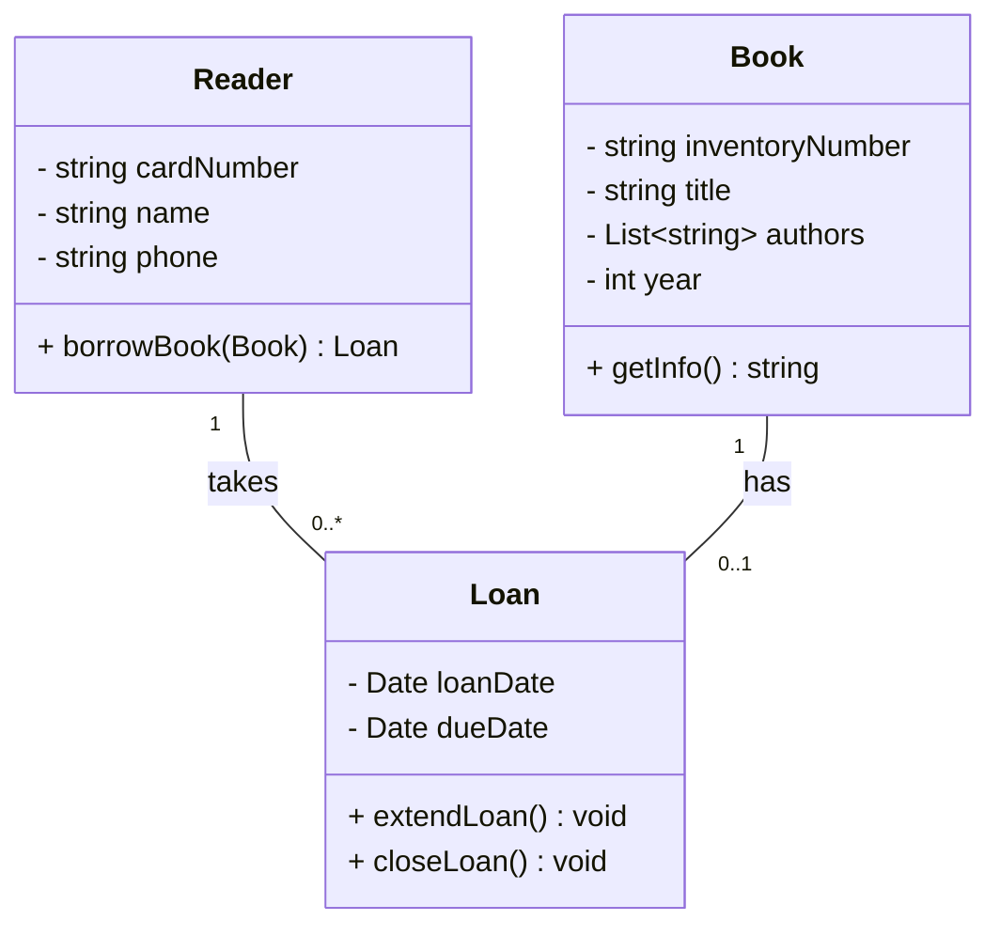
```mermaid
classDiagram
    class Book {
        - string inventoryNumber
        - string title
        - List~string~ authors
        - int year
        + getInfo() string
    }

    class Reader {
        - string cardNumber
        - string name
        - string phone
        + borrowBook(Book) Loan
    }

    class Loan {
        - Date loanDate
        - Date dueDate
        + extendLoan() void
        + closeLoan() void
    }

    Reader "1" -- "0..*" Loan : takes
    Book "1" -- "0..1" Loan : has
```

**Пояснение к диаграмме:**
- Класс `Book` содержит инвентарный номер, название, список авторов и год издания.
- Класс `Reader` содержит уникальный номер билета, имя и телефон.
- Класс `Loan` связывает книгу и читателя, содержит даты выдачи и возврата.
- Связь между `Reader` и `Loan` — «один ко многим» (композиция, т.к. выдача не существует без читателя).
- Связь между `Book` и `Loan` — «один к нулю или одному» (книга может быть не выдана или выдана одному читателю).

---

### Практическое задание 2 (Код на C#) — Наблюдатель (Observer)

```csharp
using System;
using System.Collections.Generic;

// Интерфейс наблюдателя
public interface IObserver
{
    void Update(string news);
}

// Интерфейс наблюдаемого объекта
public interface IObservable
{
    void Subscribe(IObserver observer);
    void Unsubscribe(IObserver observer);
    void NotifyObservers();
}

// Издатель новостей
public class NewsAgency : IObservable
{
    private List<IObserver> _observers = new List<IObserver>();
    private string _latestNews;

    public void SetNews(string news)
    {
        _latestNews = news;
        NotifyObservers();
    }

    public void Subscribe(IObserver observer)
    {
        _observers.Add(observer);
    }

    public void Unsubscribe(IObserver observer)
    {
        _observers.Remove(observer);
    }

    public void NotifyObservers()
    {
        foreach (var observer in _observers)
            observer.Update(_latestNews);
    }
}

// Подписчик
public class Subscriber : IObserver
{
    private string _name;

    public Subscriber(string name)
    {
        _name = name;
    }

    public void Update(string news)
    {
        Console.WriteLine($"{_name} получил новость: {news}");
    }
}

// Демонстрация
class Program
{
    static void Main()
    {
        NewsAgency agency = new NewsAgency();
        Subscriber sub1 = new Subscriber("Иван");
        Subscriber sub2 = new Subscriber("Мария");

        agency.Subscribe(sub1);
        agency.Subscribe(sub2);

        agency.SetNews("Первая новость!");

        agency.Unsubscribe(sub1);
        agency.SetNews("Вторая новость (только для Марии).");

        Console.ReadKey();
    }
}
```

---
---

## Билет №2

### Ответы на тест

1. **диаграмма деятельности** (Activity Diagram)
2. **-** (минус, private)
3. **операций** (раздел операций)
4. **Стратегия** (Strategy)
5. **SRP** (Принцип единственной ответственности / Single Responsibility Principle)

---

### Практическое задание 1 (UML) — Диаграмма последовательности двухфакторной аутентификации

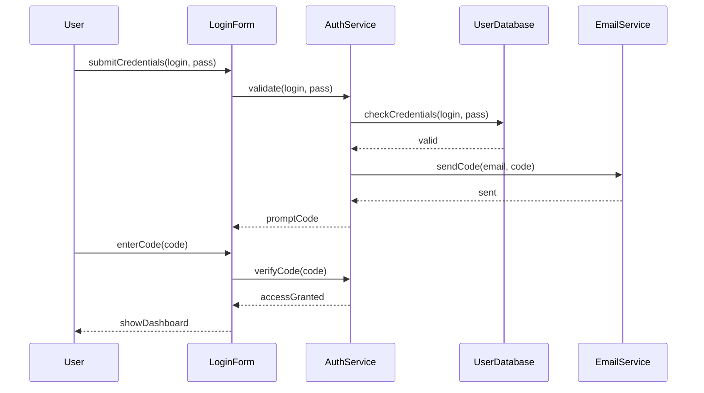
```mermaid
sequenceDiagram
    participant User
    participant LoginForm
    participant AuthService
    participant UserDatabase
    participant EmailService

    User->>LoginForm: submitCredentials(login, pass)
    LoginForm->>AuthService: validate(login, pass)
    AuthService->>UserDatabase: checkCredentials(login, pass)
    UserDatabase-->>AuthService: valid
    AuthService->>EmailService: sendCode(email, code)
    EmailService-->>AuthService: sent
    AuthService-->>LoginForm: promptCode
    User->>LoginForm: enterCode(code)
    LoginForm->>AuthService: verifyCode(code)
    AuthService-->>LoginForm: accessGranted
    LoginForm-->>User: showDashboard
```

---

### Практическое задание 2 (Код на C#) — Строитель (Builder)

```csharp
using System;

public class Computer
{
    public string CPU { get; private set; }
    public int RAM { get; private set; }
    public string Storage { get; private set; }
    public string GraphicsCard { get; private set; }

    private Computer() { }

    public class ComputerBuilder
    {
        private Computer _computer = new Computer();

        public ComputerBuilder SetCPU(string cpu)
        {
            _computer.CPU = cpu;
            return this;
        }

        public ComputerBuilder SetRAM(int ram)
        {
            _computer.RAM = ram;
            return this;
        }

        public ComputerBuilder SetStorage(string storage)
        {
            _computer.Storage = storage;
            return this;
        }

        public ComputerBuilder SetGraphicsCard(string gpu)
        {
            _computer.GraphicsCard = gpu;
            return this;
        }

        public Computer Build()
        {
            if (string.IsNullOrEmpty(_computer.CPU) || _computer.RAM <= 0)
                throw new InvalidOperationException("Обязательные параметры не заданы");
            return _computer;
        }
    }
}

class Program
{
    static void Main()
    {
        var gamingPC = new Computer.ComputerBuilder()
            .SetCPU("Intel Core i9")
            .SetRAM(32)
            .SetStorage("SSD 1TB")
            .SetGraphicsCard("NVIDIA RTX 4080")
            .Build();

        var officePC = new Computer.ComputerBuilder()
            .SetCPU("Intel Core i3")
            .SetRAM(8)
            .SetStorage("HDD 500GB")
            .Build();

        Console.WriteLine($"Gaming PC: {gamingPC.CPU}, {gamingPC.RAM}GB RAM, {gamingPC.Storage}, {gamingPC.GraphicsCard}");
        Console.WriteLine($"Office PC: {officePC.CPU}, {officePC.RAM}GB RAM, {officePC.Storage}, {officePC.GraphicsCard}");
        Console.ReadKey();
    }
}
```

---
---

## Билет №3

### Ответы на тест

1. **пунктирной линией с открытой стрелкой** (или просто «пунктирная линия со стрелкой»)
2. **protected** (защищённый)
3. **развёртывания** (диаграмма развёртывания / Deployment Diagram)
4. **Прокси** (Proxy)
5. **ISP** (Принцип разделения интерфейса / Interface Segregation Principle)

---

### Практическое задание 1 (UML) — Диаграмма состояний заказа

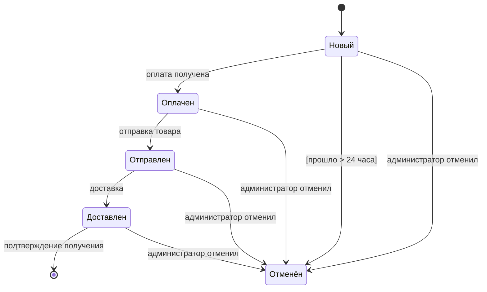
```mermaid
stateDiagram-v2
    [*] --> Новый
    Новый --> Оплачен : оплата получена
    Новый --> Отменён : [прошло > 24 часа]
    Оплачен --> Отправлен : отправка товара
    Отправлен --> Доставлен : доставка
    Доставлен --> [*] : подтверждение получения
    Новый --> Отменён : администратор отменил
    Оплачен --> Отменён : администратор отменил
    Отправлен --> Отменён : администратор отменил
    Доставлен --> Отменён : администратор отменил
```

---

### Практическое задание 2 (Код на C#) — Абстрактная фабрика (Abstract Factory)

```csharp
using System;

// Абстрактные продукты
public interface IButton { void Render(); }
public interface ICheckbox { void Render(); }

// Конкретные продукты для Windows
public class WindowsButton : IButton
{
    public void Render() => Console.WriteLine("[Windows Style] Button");
}
public class WindowsCheckbox : ICheckbox
{
    public void Render() => Console.WriteLine("[Windows Style] Checkbox");
}

// Конкретные продукты для Mac
public class MacButton : IButton
{
    public void Render() => Console.WriteLine("[Mac Style] Button");
}
public class MacCheckbox : ICheckbox
{
    public void Render() => Console.WriteLine("[Mac Style] Checkbox");
}

// Абстрактная фабрика
public interface IUIFactory
{
    IButton CreateButton();
    ICheckbox CreateCheckbox();
}

// Конкретные фабрики
public class WindowsFactory : IUIFactory
{
    public IButton CreateButton() => new WindowsButton();
    public ICheckbox CreateCheckbox() => new WindowsCheckbox();
}

public class MacFactory : IUIFactory
{
    public IButton CreateButton() => new MacButton();
    public ICheckbox CreateCheckbox() => new MacCheckbox();
}

// Клиентский код
class Program
{
    static void CreateUI(IUIFactory factory)
    {
        var button = factory.CreateButton();
        var checkbox = factory.CreateCheckbox();
        button.Render();
        checkbox.Render();
    }

    static void Main()
    {
        Console.WriteLine("Windows UI:");
        CreateUI(new WindowsFactory());

        Console.WriteLine("\nMac UI:");
        CreateUI(new MacFactory());

        Console.ReadKey();
    }
}
```

---
---

## Билет №4

### Ответы на тест

1. **ассоциация**
2. **реализация** (или **realize**)
3. **$** (знак доллара)
4. **Адаптер** (Adapter)
5. **LSP** (Принцип подстановки Лисков / Liskov Substitution Principle)

---

### Практическое задание 1 (UML) — Диаграмма классов платёжной системы

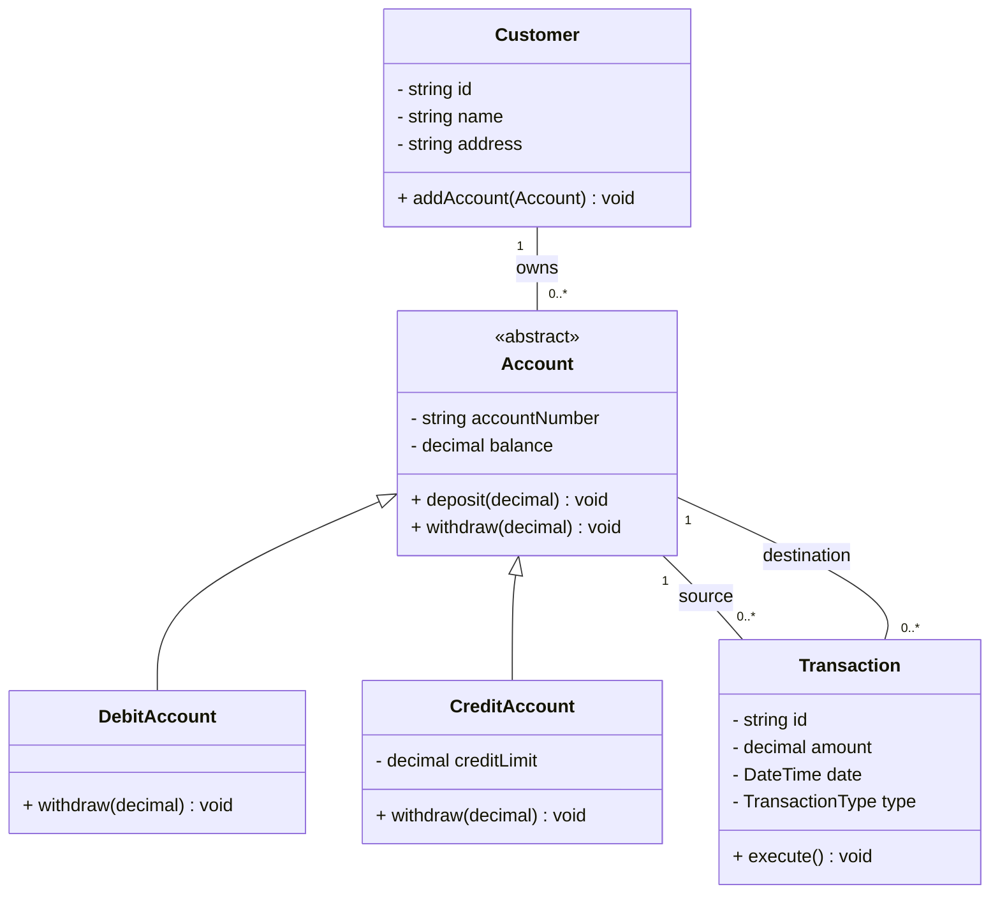
```mermaid
classDiagram
    class Customer {
        - string id
        - string name
        - string address
        + addAccount(Account) void
    }

    class Account {
        <<abstract>>
        - string accountNumber
        - decimal balance
        + deposit(decimal) void
        + withdraw(decimal) void
    }

    class DebitAccount {
        + withdraw(decimal) void
    }

    class CreditAccount {
        - decimal creditLimit
        + withdraw(decimal) void
    }

    class Transaction {
        - string id
        - decimal amount
        - DateTime date
        - TransactionType type
        + execute() void
    }

    Customer "1" -- "0..*" Account : owns
    Account <|-- DebitAccount
    Account <|-- CreditAccount
    Account "1" -- "0..*" Transaction : source
    Account "1" -- "0..*" Transaction : destination
```

---

### Практическое задание 2 (Код на C#) — Декоратор (Decorator)

```csharp
using System;

public interface INotifier
{
    void Send(string message);
}

public class BaseNotifier : INotifier
{
    public void Send(string message)
    {
        Console.WriteLine(message);
    }
}

public abstract class NotifierDecorator : INotifier
{
    protected INotifier _wrapped;

    public NotifierDecorator(INotifier wrapped)
    {
        _wrapped = wrapped;
    }

    public virtual void Send(string message)
    {
        _wrapped.Send(message);
    }
}

public class SMSDecorator : NotifierDecorator
{
    public SMSDecorator(INotifier wrapped) : base(wrapped) { }

    public override void Send(string message)
    {
        _wrapped.Send($"[SMS] {message}");
    }
}

public class EmailDecorator : NotifierDecorator
{
    public EmailDecorator(INotifier wrapped) : base(wrapped) { }

    public override void Send(string message)
    {
        _wrapped.Send($"[Email] {message}");
    }
}

class Program
{
    static void Main()
    {
        INotifier notifier = new BaseNotifier();
        notifier = new SMSDecorator(notifier);
        notifier = new EmailDecorator(notifier);
        notifier.Send("Ваш заказ готов!");

        Console.ReadKey();
    }
}
```

---
---

## Билет №5

### Ответы на тест

1. **развилка** (fork) или **ветвление**
2. **~** (тильда)
3. **классов** (диаграмма классов)
4. **Итератор** (Iterator)
5. **DIP** (Принцип инверсии зависимостей)

---

### Практическое задание 1 (UML) — Диаграмма последовательности покупки товара

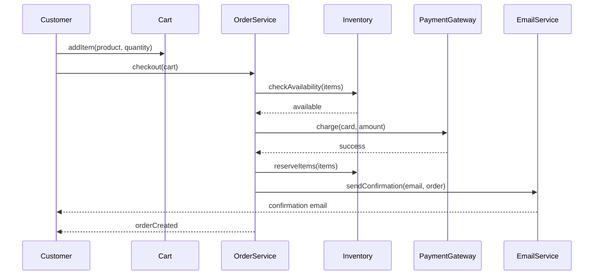
```mermaid
sequenceDiagram
    participant Customer
    participant Cart
    participant OrderService
    participant Inventory
    participant PaymentGateway
    participant EmailService

    Customer->>Cart: addItem(product, quantity)
    Customer->>OrderService: checkout(cart)
    OrderService->>Inventory: checkAvailability(items)
    Inventory-->>OrderService: available
    OrderService->>PaymentGateway: charge(card, amount)
    PaymentGateway-->>OrderService: success
    OrderService->>Inventory: reserveItems(items)
    OrderService->>EmailService: sendConfirmation(email, order)
    EmailService-->>Customer: confirmation email
    OrderService-->>Customer: orderCreated
```

---

### Практическое задание 2 (Код на C#) — Фабричный метод (Factory Method)

```csharp
using System;

public interface IDocument
{
    void Open();
}

public class PdfDocument : IDocument
{
    public void Open() => Console.WriteLine("Открыт PDF документ");
}

public class DocxDocument : IDocument
{
    public void Open() => Console.WriteLine("Открыт DOCX документ");
}

public abstract class DocumentCreator
{
    public abstract IDocument CreateDocument();

    public void OpenDocument()
    {
        var doc = CreateDocument();
        doc.Open();
    }
}

public class PdfCreator : DocumentCreator
{
    public override IDocument CreateDocument() => new PdfDocument();
}

public class DocxCreator : DocumentCreator
{
    public override IDocument CreateDocument() => new DocxDocument();
}

class Program
{
    static void Main()
    {
        DocumentCreator pdfCreator = new PdfCreator();
        pdfCreator.OpenDocument();

        DocumentCreator docxCreator = new DocxCreator();
        docxCreator.OpenDocument();

        Console.ReadKey();
    }
}
```

---
---

## Билет №6

### Ответы на тест

1. **коммуникации** (диаграмма коммуникации / Communication Diagram)
2. **$** (доллар)
3. **композиция**
4. **Команда** (Command)
5. **OCP** (Принцип открытости/закрытости / Open/Closed Principle)

---

### Практическое задание 1 (UML) — Диаграмма состояний банкомата

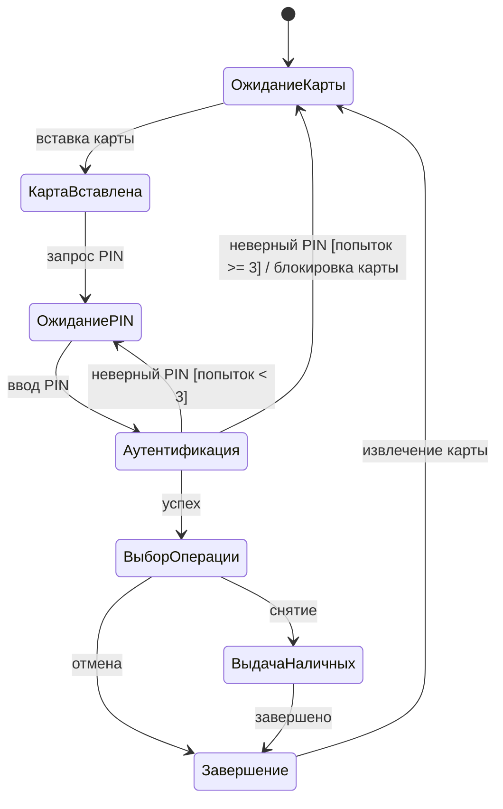
```mermaid
stateDiagram-v2
    [*] --> ОжиданиеКарты
    ОжиданиеКарты --> КартаВставлена : вставка карты
    КартаВставлена --> ОжиданиеPIN : запрос PIN
    ОжиданиеPIN --> Аутентификация : ввод PIN
    Аутентификация --> ВыборОперации : успех
    Аутентификация --> ОжиданиеPIN : неверный PIN [попыток < 3]
    Аутентификация --> ОжиданиеКарты : неверный PIN [попыток >= 3] / блокировка карты
    ВыборОперации --> ВыдачаНаличных : снятие
    ВыборОперации --> Завершение : отмена
    ВыдачаНаличных --> Завершение : завершено
    Завершение --> ОжиданиеКарты : извлечение карты
```

---

### Практическое задание 2 (Код на C#) — Команда (Command)

```csharp
using System;

// Интерфейс команды
public interface ICommand
{
    void Execute();
}

// Получатели
public class Light
{
    public void TurnOn() => Console.WriteLine("Свет включен");
    public void TurnOff() => Console.WriteLine("Свет выключен");
}

public class MusicPlayer
{
    public void Play() => Console.WriteLine("Музыка играет");
}

// Конкретные команды
public class LightOnCommand : ICommand
{
    private Light _light;
    public LightOnCommand(Light light) => _light = light;
    public void Execute() => _light.TurnOn();
}

public class LightOffCommand : ICommand
{
    private Light _light;
    public LightOffCommand(Light light) => _light = light;
    public void Execute() => _light.TurnOff();
}

public class MusicPlayCommand : ICommand
{
    private MusicPlayer _player;
    public MusicPlayCommand(MusicPlayer player) => _player = player;
    public void Execute() => _player.Play();
}

// Инициатор
public class RemoteControl
{
    private ICommand _command;
    public void SetCommand(ICommand command) => _command = command;
    public void PressButton() => _command?.Execute();
}

class Program
{
    static void Main()
    {
        Light light = new Light();
        MusicPlayer player = new MusicPlayer();
        RemoteControl remote = new RemoteControl();

        remote.SetCommand(new LightOnCommand(light));
        remote.PressButton();

        remote.SetCommand(new MusicPlayCommand(player));
        remote.PressButton();

        remote.SetCommand(new LightOffCommand(light));
        remote.PressButton();

        Console.ReadKey();
    }
}
```

---
---

## Билет №7

### Ответы на тест

1. **профиль** (UML Profile)
2. **0..1**
3. **пакет** (Package)
4. **Цепочка обязанностей** (Chain of Responsibility)
5. **MVC** (Model-View-Controller)

---

### Практическое задание 1 (UML) — Диаграмма компонентов веб-приложения

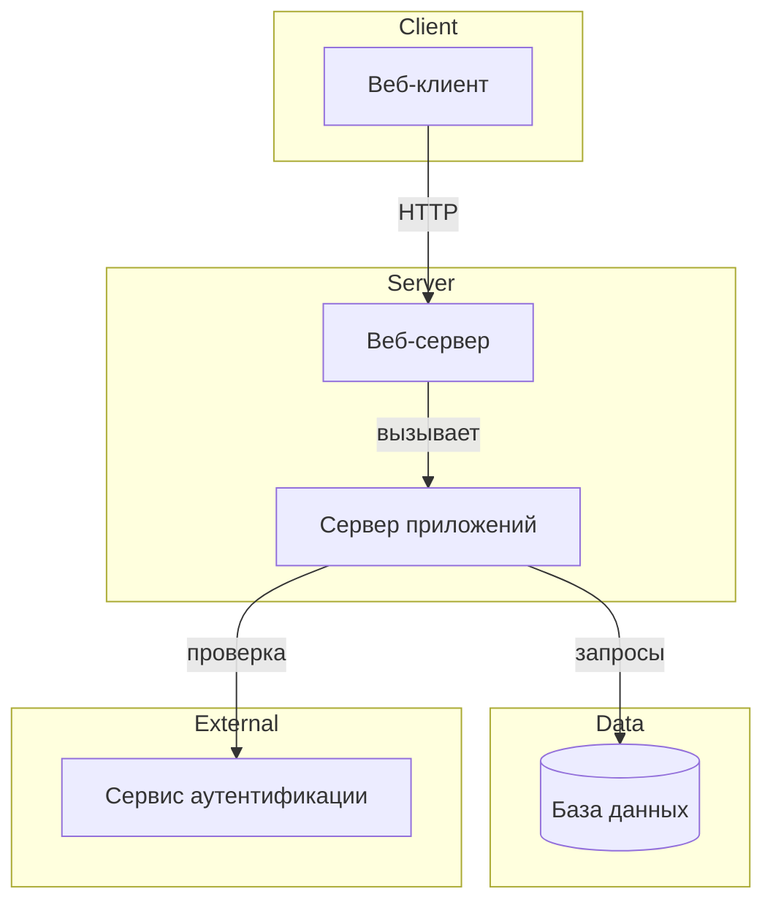
```mermaid
graph TD
    subgraph Client
        Browser[Веб-клиент]
    end

    subgraph Server
        WebServer[Веб-сервер]
        AppServer[Сервер приложений]
    end

    subgraph Data
        DB[(База данных)]
    end

    subgraph External
        Auth[Сервис аутентификации]
    end

    Browser -- HTTP --> WebServer
    WebServer -- вызывает --> AppServer
    AppServer -- запросы --> DB
    AppServer -- проверка --> Auth
```

*Примечание: Mermaid не поддерживает диаграмму компонентов напрямую, поэтому использована упрощённая диаграмма графа.*

---

### Практическое задание 2 (Код на C#) — Цепочка обязанностей (Chain of Responsibility)

```csharp
using System;

public abstract class Handler
{
    protected Handler _next;

    public void SetNext(Handler next) => _next = next;

    public abstract void Handle(string request);
}

public class AuthenticationHandler : Handler
{
    public override void Handle(string request)
    {
        if (request.Contains("token"))
        {
            Console.WriteLine("Аутентификация пройдена.");
            _next?.Handle(request);
        }
        else
        {
            Console.WriteLine("Аутентификация не пройдена. Доступ запрещён.");
        }
    }
}

public class LoggingHandler : Handler
{
    public override void Handle(string request)
    {
        Console.WriteLine($"Запрос залогирован: {request}");
        _next?.Handle(request);
    }
}

public class ValidationHandler : Handler
{
    public override void Handle(string request)
    {
        if (request.Contains("valid"))
        {
            Console.WriteLine("Валидация пройдена.");
            _next?.Handle(request);
        }
        else
        {
            Console.WriteLine("Валидация не пройдена.");
        }
    }
}

class Program
{
    static void Main()
    {
        var auth = new AuthenticationHandler();
        var log = new LoggingHandler();
        var valid = new ValidationHandler();

        auth.SetNext(log);
        log.SetNext(valid);

        auth.Handle("request with token and valid data");

        Console.ReadKey();
    }
}
```

---
---

## Билет №8

### Ответы на тест

1. **временных ограничений** (Timing Diagram)
2. **курсивом** (или «имя курсивом»)
3. **Хранитель** (Memento)
4. **Шаблонный метод** (Template Method)
5. **ISP** (Принцип разделения интерфейса)

---

### Практическое задание 1 (UML) — Диаграмма классов игры «Морской бой»

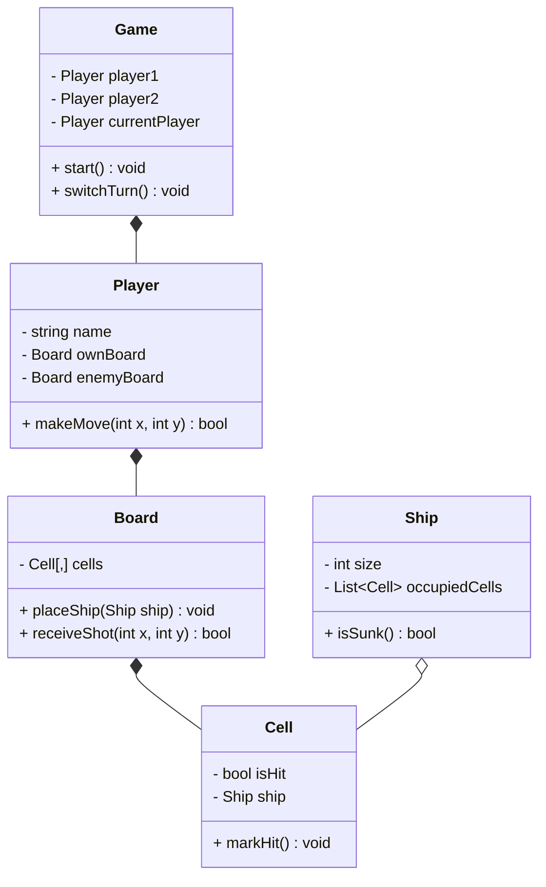
```mermaid
classDiagram
    class Game {
        - Player player1
        - Player player2
        - Player currentPlayer
        + start() void
        + switchTurn() void
    }

    class Player {
        - string name
        - Board ownBoard
        - Board enemyBoard
        + makeMove(int x, int y) bool
    }

    class Board {
        - Cell[,] cells
        + placeShip(Ship ship) void
        + receiveShot(int x, int y) bool
    }

    class Cell {
        - bool isHit
        - Ship ship
        + markHit() void
    }

    class Ship {
        - int size
        - List~Cell~ occupiedCells
        + isSunk() bool
    }

    Game *-- Player
    Player *-- Board
    Board *-- Cell
    Ship o-- Cell
```

---

### Практическое задание 2 (Код на C#) — Состояние (State)

```csharp
using System;

public interface ITcpState
{
    void Open(TcpConnection context);
    void Close(TcpConnection context);
    void SendData(TcpConnection context, string data);
}

public class TcpConnection
{
    private ITcpState _state;

    public TcpConnection()
    {
        _state = new ClosedState();
    }

    public void SetState(ITcpState state) => _state = state;

    public void Open() => _state.Open(this);
    public void Close() => _state.Close(this);
    public void SendData(string data) => _state.SendData(this, data);
}

public class ClosedState : ITcpState
{
    public void Open(TcpConnection context)
    {
        Console.WriteLine("Соединение открыто (Listening)");
        context.SetState(new ListeningState());
    }
    public void Close(TcpConnection context) => Console.WriteLine("Соединение уже закрыто");
    public void SendData(TcpConnection context, string data) => Console.WriteLine("Невозможно отправить данные: соединение закрыто");
}

public class ListeningState : ITcpState
{
    public void Open(TcpConnection context) => Console.WriteLine("Соединение уже открыто");
    public void Close(TcpConnection context)
    {
        Console.WriteLine("Соединение закрыто");
        context.SetState(new ClosedState());
    }
    public void SendData(TcpConnection context, string data)
    {
        Console.WriteLine($"Данные отправлены: {data}");
        context.SetState(new EstablishedState());
    }
}

public class EstablishedState : ITcpState
{
    public void Open(TcpConnection context) => Console.WriteLine("Соединение уже установлено");
    public void Close(TcpConnection context)
    {
        Console.WriteLine("Закрытие соединения...");
        context.SetState(new ClosingState());
    }
    public void SendData(TcpConnection context, string data) => Console.WriteLine($"Данные отправлены: {data}");
}

public class ClosingState : ITcpState
{
    public void Open(TcpConnection context) => Console.WriteLine("Невозможно открыть: соединение закрывается");
    public void Close(TcpConnection context) => Console.WriteLine("Соединение уже закрывается");
    public void SendData(TcpConnection context, string data) => Console.WriteLine("Невозможно отправить: соединение закрывается");
}

class Program
{
    static void Main()
    {
        var conn = new TcpConnection();
        conn.Open();
        conn.SendData("Hello");
        conn.Close();
        Console.ReadKey();
    }
}
```

---
---

## Билет №9

### Ответы на тест

1. **пунктирной линией с открытой стрелкой** (зависимость)
2. **#** (решётка)
3. **Посредник** (Mediator)
4. **Мост** (Bridge)
5. **развёртывания** (Deployment Diagram)

---

### Практическое задание 1 (UML) — Диаграмма последовательности отправки сообщения

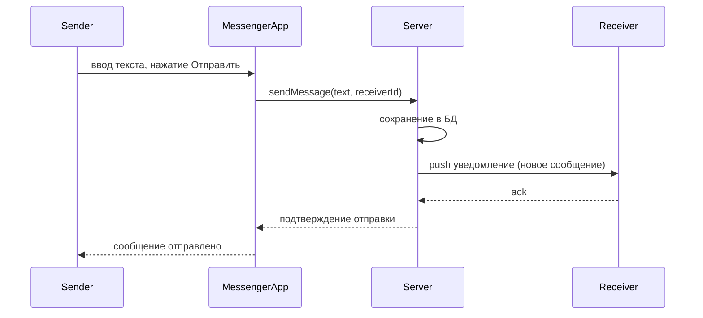
```mermaid
sequenceDiagram
    participant Sender
    participant MessengerApp
    participant Server
    participant Receiver

    Sender->>MessengerApp: ввод текста, нажатие Отправить
    MessengerApp->>Server: sendMessage(text, receiverId)
    Server->>Server: сохранение в БД
    Server->>Receiver: push уведомление (новое сообщение)
    Receiver-->>Server: ack
    Server-->>MessengerApp: подтверждение отправки
    MessengerApp-->>Sender: сообщение отправлено
```

---

### Практическое задание 2 (Код на C#) — Мост (Bridge)

```csharp
using System;

// Реализация
public interface IDevice
{
    void TurnOn();
    void TurnOff();
    void SetChannel(int channel);
}

public class SamsungTV : IDevice
{
    public void TurnOn() => Console.WriteLine("Samsung TV включен");
    public void TurnOff() => Console.WriteLine("Samsung TV выключен");
    public void SetChannel(int channel) => Console.WriteLine($"Samsung TV: канал {channel}");
}

public class SonyTV : IDevice
{
    public void TurnOn() => Console.WriteLine("Sony TV включен");
    public void TurnOff() => Console.WriteLine("Sony TV выключен");
    public void SetChannel(int channel) => Console.WriteLine($"Sony TV: канал {channel}");
}

// Абстракция
public class RemoteControl
{
    protected IDevice _device;

    public RemoteControl(IDevice device) => _device = device;

    public virtual void TogglePower()
    {
        // Упрощённо: всегда включаем
        _device.TurnOn();
    }

    public virtual void ChannelUp()
    {
        _device.SetChannel(1); // условно
    }
}

public class AdvancedRemote : RemoteControl
{
    public AdvancedRemote(IDevice device) : base(device) { }

    public void Mute() => Console.WriteLine("Звук выключен (Mute)");
}

class Program
{
    static void Main()
    {
        IDevice samsung = new SamsungTV();
        RemoteControl basicRemote = new RemoteControl(samsung);
        basicRemote.TogglePower();
        basicRemote.ChannelUp();

        IDevice sony = new SonyTV();
        AdvancedRemote advancedRemote = new AdvancedRemote(sony);
        advancedRemote.TogglePower();
        advancedRemote.Mute();

        Console.ReadKey();
    }
}
```

---
---

## Билет №10

### Ответы на тест

1. **импорт** (import) или **зависимость**
2. **extend** (или `<<extend>>`)
3. **узел** (Node)
4. **Компоновщик** (Composite)
5. **Приспособленец** (Flyweight)

---

### Практическое задание 1 (UML) — Диаграмма деятельности регистрации на конференцию

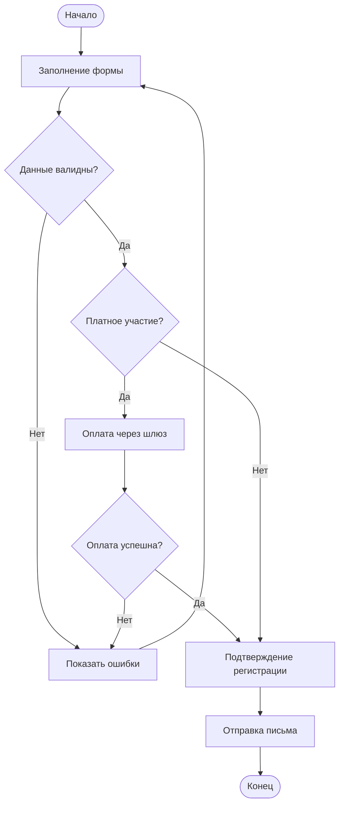
```mermaid
flowchart TD
    Start([Начало]) --> FillForm[Заполнение формы]
    FillForm --> Validate{Данные валидны?}
    Validate -- Нет --> ShowError[Показать ошибки] --> FillForm
    Validate -- Да --> CheckPaid{Платное участие?}
    CheckPaid -- Да --> Payment[Оплата через шлюз]
    Payment --> PaymentResult{Оплата успешна?}
    PaymentResult -- Нет --> ShowError
    PaymentResult -- Да --> Confirm[Подтверждение регистрации]
    CheckPaid -- Нет --> Confirm
    Confirm --> SendEmail[Отправка письма]
    SendEmail --> Stop([Конец])
```

---

### Практическое задание 2 (Код на C#) — Хранитель (Memento)

```csharp
using System;
using System.Collections.Generic;

// Снимок состояния
public class EditorMemento
{
    public string Text { get; private set; }
    public EditorMemento(string text) => Text = text;
}

// Originator
public class TextEditor
{
    public string Text { get; private set; } = "";

    public void SetText(string text)
    {
        Text = text;
        Console.WriteLine($"Текст изменён: {Text}");
    }

    public EditorMemento Save() => new EditorMemento(Text);

    public void Restore(EditorMemento memento)
    {
        Text = memento.Text;
        Console.WriteLine($"Текст восстановлен: {Text}");
    }
}

// Caretaker
public class History
{
    private Stack<EditorMemento> _mementos = new Stack<EditorMemento>();

    public void Push(EditorMemento m) => _mementos.Push(m);
    public EditorMemento Pop() => _mementos.Pop();
}

class Program
{
    static void Main()
    {
        TextEditor editor = new TextEditor();
        History history = new History();

        editor.SetText("Привет");
        history.Push(editor.Save());

        editor.SetText("Привет, мир!");
        history.Push(editor.Save());

        editor.SetText("Привет, мир! Как дела?");

        // Отмена последнего изменения
        editor.Restore(history.Pop()); // "Привет, мир!"
        editor.Restore(history.Pop()); // "Привет"

        Console.ReadKey();
    }
}
```

---
---

## Билет №11

### Ответы на тест

1. **объектов** (диаграмма объектов / Object Diagram)
2. **+** (плюс)
3. **include** (или `<<include>>`)
4. **Декоратор** (Decorator)
5. **Строитель** (Builder)

---

### Практическое задание 1 (UML) — Диаграмма классов бронирования авиабилетов

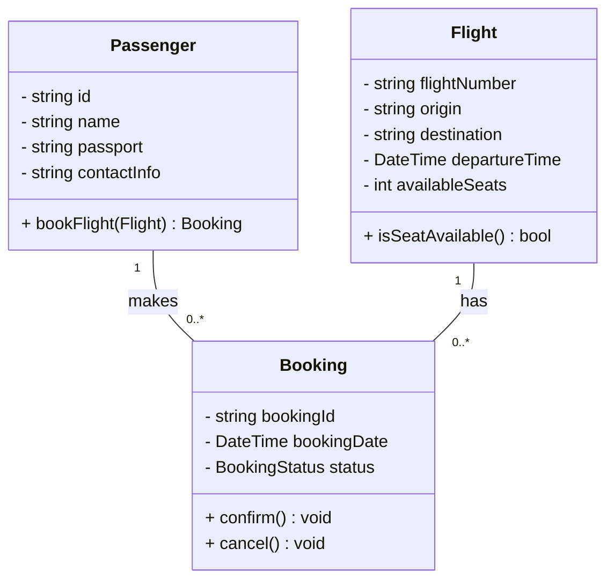
```mermaid
classDiagram
    class Passenger {
        - string id
        - string name
        - string passport
        - string contactInfo
        + bookFlight(Flight) Booking
    }

    class Flight {
        - string flightNumber
        - string origin
        - string destination
        - DateTime departureTime
        - int availableSeats
        + isSeatAvailable() bool
    }

    class Booking {
        - string bookingId
        - DateTime bookingDate
        - BookingStatus status
        + confirm() void
        + cancel() void
    }

    Passenger "1" -- "0..*" Booking : makes
    Flight "1" -- "0..*" Booking : has
```

---

### Практическое задание 2 (Код на C#) — Посредник (Mediator)

```csharp
using System;

public interface IMediator
{
    void Notify(object sender, string ev);
}

public class DialogMediator : IMediator
{
    private Button _button;
    private TextBox _textBox;
    private Checkbox _checkbox;

    public DialogMediator(Button btn, TextBox txt, Checkbox chk)
    {
        _button = btn;
        _textBox = txt;
        _checkbox = chk;
        _button.SetMediator(this);
        _textBox.SetMediator(this);
        _checkbox.SetMediator(this);
    }

    public void Notify(object sender, string ev)
    {
        if (sender == _checkbox && ev == "checked")
        {
            _button.SetEnabled(false);
            Console.WriteLine("Кнопка заблокирована");
        }
        if (sender == _checkbox && ev == "unchecked")
        {
            _button.SetEnabled(true);
            Console.WriteLine("Кнопка разблокирована");
        }
        if (sender == _button && ev == "click")
        {
            _textBox.Clear();
            Console.WriteLine("Текстовое поле очищено");
        }
    }
}

public class Component
{
    protected IMediator _mediator;
    public void SetMediator(IMediator mediator) => _mediator = mediator;
}

public class Button : Component
{
    private bool _enabled = true;
    public void Click()
    {
        if (_enabled)
            _mediator?.Notify(this, "click");
    }
    public void SetEnabled(bool enabled) => _enabled = enabled;
}

public class TextBox : Component
{
    private string _text = "";
    public void Clear()
    {
        _text = "";
        Console.WriteLine("TextBox: очищено");
    }
    public void SetText(string text) => _text = text;
}

public class Checkbox : Component
{
    private bool _checked = false;
    public void Check()
    {
        _checked = !_checked;
        _mediator?.Notify(this, _checked ? "checked" : "unchecked");
    }
}

class Program
{
    static void Main()
    {
        Button btn = new Button();
        TextBox txt = new TextBox();
        Checkbox chk = new Checkbox();

        DialogMediator mediator = new DialogMediator(btn, txt, chk);

        btn.Click();
        chk.Check();   // блокирует кнопку
        btn.Click();   // не сработает
        chk.Check();   // разблокирует
        btn.Click();   // сработает

        Console.ReadKey();
    }
}
```

---
---

## Билет №12

### Ответы на тест

1. **пакетов** (диаграмма пакетов / Package Diagram)
2. **+** (плюс)
3. **ноль или более** (или «любое количество»)
4. **Прототип** (Prototype)
5. **Фасад** (Facade)

---

### Практическое задание 1 (UML) — Диаграмма развёртывания микросервисов

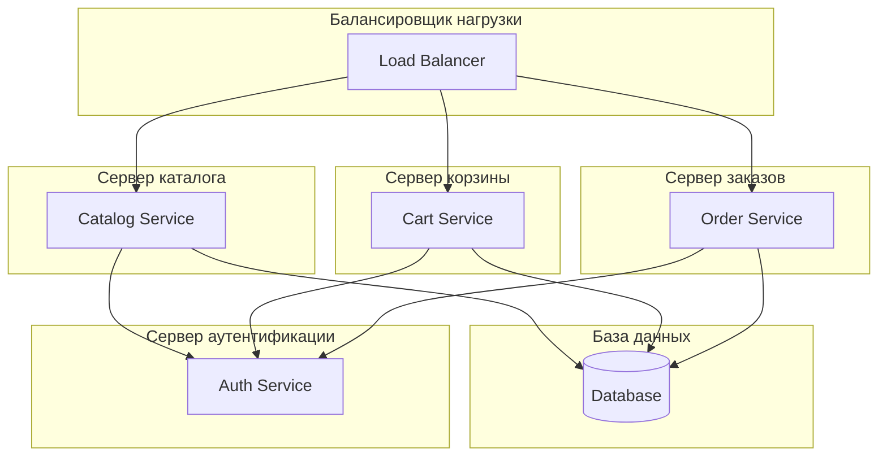
```mermaid
graph TD
    subgraph "Балансировщик нагрузки"
        LB[Load Balancer]
    end

    subgraph "Сервер каталога"
        Catalog[Catalog Service]
    end

    subgraph "Сервер корзины"
        Cart[Cart Service]
    end

    subgraph "Сервер заказов"
        Order[Order Service]
    end

    subgraph "База данных"
        DB[(Database)]
    end

    subgraph "Сервер аутентификации"
        Auth[Auth Service]
    end

    LB --> Catalog
    LB --> Cart
    LB --> Order
    Catalog --> DB
    Cart --> DB
    Order --> DB
    Catalog --> Auth
    Cart --> Auth
    Order --> Auth
```

---

### Практическое задание 2 (Код на C#) — Итератор (Iterator)

```csharp
using System;
using System.Collections.Generic;

public class Employee
{
    public string Name { get; set; }
    public string Position { get; set; }
    public Employee(string name, string position)
    {
        Name = name;
        Position = position;
    }
}

public interface IIterator<T>
{
    bool HasNext();
    T Next();
}

public class DepartmentIterator : IIterator<Employee>
{
    private List<Employee> _employees;
    private int _position = 0;

    public DepartmentIterator(List<Employee> employees)
    {
        _employees = employees;
    }

    public bool HasNext() => _position < _employees.Count;

    public Employee Next() => _employees[_position++];
}

public class Department
{
    private List<Employee> _employees = new List<Employee>();

    public void AddEmployee(Employee emp) => _employees.Add(emp);

    public IIterator<Employee> CreateIterator() => new DepartmentIterator(_employees);
}

class Program
{
    static void Main()
    {
        Department dept = new Department();
        dept.AddEmployee(new Employee("Иван", "Менеджер"));
        dept.AddEmployee(new Employee("Мария", "Разработчик"));
        dept.AddEmployee(new Employee("Петр", "Тестировщик"));

        IIterator<Employee> iterator = dept.CreateIterator();
        while (iterator.HasNext())
        {
            Employee emp = iterator.Next();
            Console.WriteLine($"{emp.Name} - {emp.Position}");
        }

        Console.ReadKey();
    }
}
```

---
---

## Билет №13

### Ответы на тест

1. **прецедентов** (диаграмма прецедентов / Use Case Diagram)
2. **include** (или `<<include>>`)
3. **слияние** (merge)
4. **Посетитель** (Visitor)
5. **Состояние** (State)

---

### Практическое задание 1 (UML) — Диаграмма последовательности восстановления пароля

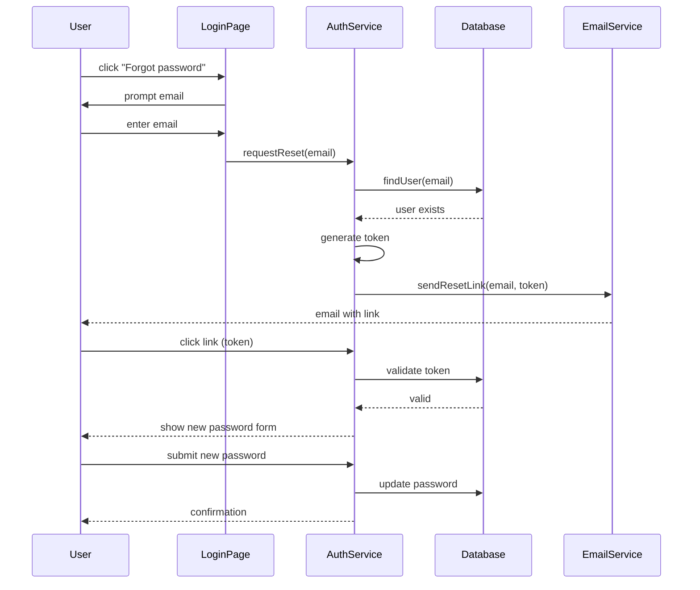
```mermaid
sequenceDiagram
    participant User
    participant LoginPage
    participant AuthService
    participant Database
    participant EmailService

    User->>LoginPage: click "Forgot password"
    LoginPage->>User: prompt email
    User->>LoginPage: enter email
    LoginPage->>AuthService: requestReset(email)
    AuthService->>Database: findUser(email)
    Database-->>AuthService: user exists
    AuthService->>AuthService: generate token
    AuthService->>EmailService: sendResetLink(email, token)
    EmailService-->>User: email with link
    User->>AuthService: click link (token)
    AuthService->>Database: validate token
    Database-->>AuthService: valid
    AuthService-->>User: show new password form
    User->>AuthService: submit new password
    AuthService->>Database: update password
    AuthService-->>User: confirmation
```

---

### Практическое задание 2 (Код на C#) — Приспособленец (Flyweight)

```csharp
using System;
using System.Collections.Generic;

// Flyweight
public class CharacterStyle
{
    public char Symbol { get; private set; }
    public string Font { get; private set; }
    public int Size { get; private set; }

    public CharacterStyle(char symbol, string font, int size)
    {
        Symbol = symbol;
        Font = font;
        Size = size;
    }

    public void Display(int row, int col)
    {
        Console.WriteLine($"Символ '{Symbol}' ({Font}, {Size}pt) в позиции ({row},{col})");
    }
}

// Flyweight Factory
public class StyleFactory
{
    private Dictionary<string, CharacterStyle> _styles = new Dictionary<string, CharacterStyle>();

    public CharacterStyle GetStyle(char symbol, string font, int size)
    {
        string key = $"{symbol}_{font}_{size}";
        if (!_styles.ContainsKey(key))
        {
            _styles[key] = new CharacterStyle(symbol, font, size);
            Console.WriteLine($"Создан новый стиль: {key}");
        }
        return _styles[key];
    }
}

// Контекст
public class Character
{
    private CharacterStyle _style;
    private int _row;
    private int _col;

    public Character(CharacterStyle style, int row, int col)
    {
        _style = style;
        _row = row;
        _col = col;
    }

    public void Display()
    {
        _style.Display(_row, _col);
    }
}

class Program
{
    static void Main()
    {
        StyleFactory factory = new StyleFactory();
        List<Character> document = new List<Character>();

        // Много символов 'A' с одинаковым стилем
        for (int i = 0; i < 10; i++)
        {
            var style = factory.GetStyle('A', "Arial", 12);
            document.Add(new Character(style, 0, i));
        }

        // Один символ 'B' с другим стилем
        var styleB = factory.GetStyle('B', "Arial", 12);
        document.Add(new Character(styleB, 1, 0));

        foreach (var ch in document)
            ch.Display();

        Console.ReadKey();
    }
}
```

---
---

## Билет №14

### Ответы на тест

1. **композиция**
2. **1..\***
3. **фокус управления** (или «активация»)
4. **Прокси** (Proxy) или **Виртуальный прокси**
5. **Наблюдатель** (Observer)

---

### Практическое задание 1 (UML) — Диаграмма состояний билета на поезд

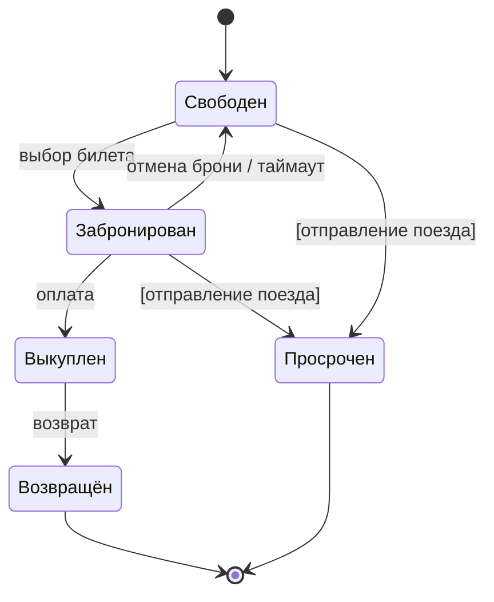
```mermaid
stateDiagram-v2
    [*] --> Свободен
    Свободен --> Забронирован : выбор билета
    Забронирован --> Выкуплен : оплата
    Забронирован --> Свободен : отмена брони / таймаут
    Забронирован --> Просрочен : [отправление поезда]
    Выкуплен --> Возвращён : возврат
    Свободен --> Просрочен : [отправление поезда]
    Возвращён --> [*]
    Просрочен --> [*]
```

---

### Практическое задание 2 (Код на C#) — Одиночка (Singleton) с потокобезопасной ленивой инициализацией

```csharp
using System;
using System.Collections.Generic;

public sealed class ConfigurationManager
{
    private static readonly Lazy<ConfigurationManager> _instance =
        new Lazy<ConfigurationManager>(() => new ConfigurationManager());

    private Dictionary<string, string> _settings;

    private ConfigurationManager()
    {
        Console.WriteLine("Загрузка конфигурации...");
        _settings = new Dictionary<string, string>
        {
            { "AppName", "MyApp" },
            { "Version", "1.0" }
        };
    }

    public static ConfigurationManager Instance => _instance.Value;

    public string GetSetting(string key)
    {
        _settings.TryGetValue(key, out string value);
        return value ?? "Не найдено";
    }
}

class Program
{
    static void Main()
    {
        var config1 = ConfigurationManager.Instance;
        var config2 = ConfigurationManager.Instance;

        Console.WriteLine(config1 == config2); // True

        Console.WriteLine(config1.GetSetting("AppName"));
        Console.ReadKey();
    }
}
```

---
---

## Билет №15

### Ответы на тест

1. **реализация** (или **realize**)
2. **прямоугольник со стереотипом `<<interface>>` или кружок**
3. **деятельности** (Activity Diagram)
4. **Команда** (Command)
5. **Мост** (Bridge)

---

### Практическое задание 1 (UML) — Диаграмма компонентов плагинной архитектуры

```mermaid
graph TD
    subgraph Core
        App[Приложение]
        PluginManager[Менеджер плагинов]
    end

    subgraph Plugins
        PluginA[PDF Экспорт]
        PluginB[DOCX Экспорт]
    end

    IPlugin[<<interface>> IPlugin]

    App --> PluginManager
    PluginManager --> IPlugin
    PluginA ..|> IPlugin
    PluginB ..|> IPlugin
```

---

### Практическое задание 2 (Код на C#) — Стратегия (Strategy)

```csharp
using System;

public interface IShippingStrategy
{
    double CalculateCost(double weight, double distance);
}

public class StandardShipping : IShippingStrategy
{
    public double CalculateCost(double weight, double distance) => weight * 5 + distance * 0.5;
}

public class ExpressShipping : IShippingStrategy
{
    public double CalculateCost(double weight, double distance) => weight * 15 + distance * 1.5;
}

public class PickupPointShipping : IShippingStrategy
{
    public double CalculateCost(double weight, double distance) => weight * 2; // без учёта расстояния
}

public class ShippingCalculator
{
    private IShippingStrategy _strategy;

    public ShippingCalculator(IShippingStrategy strategy) => _strategy = strategy;

    public void SetStrategy(IShippingStrategy strategy) => _strategy = strategy;

    public double Calculate(double weight, double distance) => _strategy.CalculateCost(weight, distance);
}

class Program
{
    static void Main()
    {
        double weight = 2.5;
        double distance = 100;

        ShippingCalculator calc = new ShippingCalculator(new StandardShipping());
        Console.WriteLine($"Стандартная доставка: {calc.Calculate(weight, distance)}");

        calc.SetStrategy(new ExpressShipping());
        Console.WriteLine($"Экспресс доставка: {calc.Calculate(weight, distance)}");

        calc.SetStrategy(new PickupPointShipping());
        Console.WriteLine($"Пункт выдачи: {calc.Calculate(weight, distance)}");

        Console.ReadKey();
    }
}
```

---
---

## Билет №16

### Ответы на тест

1. **компонентов** (Component Diagram)
2. **~** (тильда)
3. **порт** (Port)
4. **Приспособленец** (Flyweight)
5. **Прокси** (Proxy)

---

### Практическое задание 1 (UML) — Диаграмма классов онлайн-аукциона

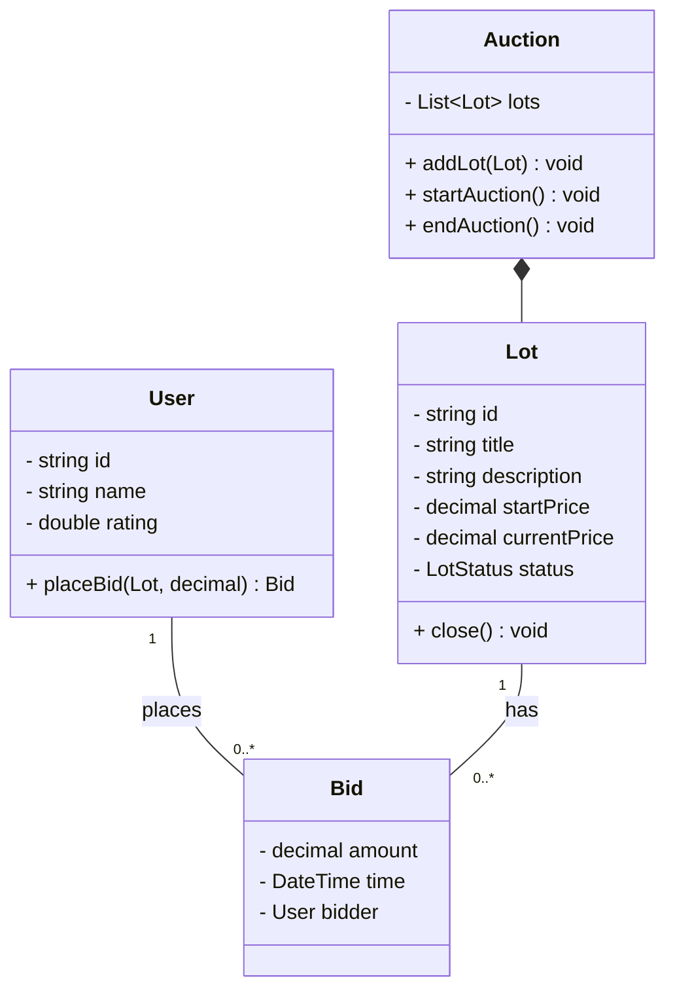
```mermaid
classDiagram
    class User {
        - string id
        - string name
        - double rating
        + placeBid(Lot, decimal) Bid
    }

    class Lot {
        - string id
        - string title
        - string description
        - decimal startPrice
        - decimal currentPrice
        - LotStatus status
        + close() void
    }

    class Bid {
        - decimal amount
        - DateTime time
        - User bidder
    }

    class Auction {
        - List~Lot~ lots
        + addLot(Lot) void
        + startAuction() void
        + endAuction() void
    }

    Auction *-- Lot
    User "1" -- "0..*" Bid : places
    Lot "1" -- "0..*" Bid : has
```

---

### Практическое задание 2 (Код на C#) — Прокси (Proxy) с кешированием

```csharp
using System;
using System.Collections.Generic;
using System.Threading;

public interface IDataService
{
    string GetData(string key);
}

public class RealDataService : IDataService
{
    public string GetData(string key)
    {
        Console.WriteLine($"Загрузка данных для ключа {key}...");
        Thread.Sleep(2000); // имитация долгой загрузки
        return $"Данные для {key}";
    }
}

public class CachedDataService : IDataService
{
    private RealDataService _realService = new RealDataService();
    private Dictionary<string, string> _cache = new Dictionary<string, string>();

    public string GetData(string key)
    {
        if (_cache.ContainsKey(key))
        {
            Console.WriteLine($"Возврат из кеша для {key}");
            return _cache[key];
        }
        else
        {
            string data = _realService.GetData(key);
            _cache[key] = data;
            return data;
        }
    }
}

class Program
{
    static void Main()
    {
        IDataService service = new CachedDataService();

        Console.WriteLine(service.GetData("A"));
        Console.WriteLine(service.GetData("B"));
        Console.WriteLine(service.GetData("A")); // из кеша

        Console.ReadKey();
    }
}
```

---
---

## Билет №17

### Ответы на тест

1. **временных ограничений** (Timing Diagram)
2. **двойной вертикальной линией** (или стереотип `<<active>>`)
3. **примечание** (Note) или **комментарий**
4. **Посетитель** (Visitor)
5. **Абстрактная фабрика** (Abstract Factory)

---

### Практическое задание 1 (UML) — Диаграмма последовательности загрузки файла

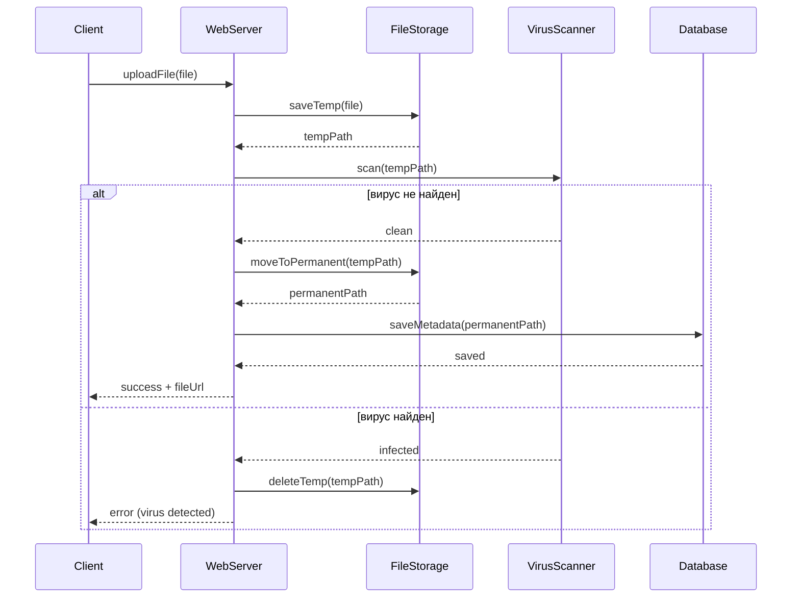
```mermaid
sequenceDiagram
    participant Client
    participant WebServer
    participant FileStorage
    participant VirusScanner
    participant Database

    Client->>WebServer: uploadFile(file)
    WebServer->>FileStorage: saveTemp(file)
    FileStorage-->>WebServer: tempPath
    WebServer->>VirusScanner: scan(tempPath)
    alt вирус не найден
        VirusScanner-->>WebServer: clean
        WebServer->>FileStorage: moveToPermanent(tempPath)
        FileStorage-->>WebServer: permanentPath
        WebServer->>Database: saveMetadata(permanentPath)
        Database-->>WebServer: saved
        WebServer-->>Client: success + fileUrl
    else вирус найден
        VirusScanner-->>WebServer: infected
        WebServer->>FileStorage: deleteTemp(tempPath)
        WebServer-->>Client: error (virus detected)
    end
```

---

### Практическое задание 2 (Код на C#) — Прототип (Prototype) с глубоким клонированием

```csharp
using System;

public interface IPrototype<T>
{
    T Clone();
}

public class Address : IPrototype<Address>
{
    public string Street { get; set; }
    public string City { get; set; }

    public Address(string street, string city)
    {
        Street = street;
        City = city;
    }

    public Address Clone() => new Address(Street, City);
}

public class Person : IPrototype<Person>
{
    public string Name { get; set; }
    public Address Address { get; set; }

    public Person(string name, Address address)
    {
        Name = name;
        Address = address;
    }

    public Person Clone() => new Person(Name, Address.Clone());
}

class Program
{
    static void Main()
    {
        Person original = new Person("Иван", new Address("Ленина", "Москва"));
        Person clone = original.Clone();

        clone.Name = "Пётр";
        clone.Address.Street = "Садовая";

        Console.WriteLine($"Оригинал: {original.Name}, {original.Address.Street}");
        Console.WriteLine($"Клон: {clone.Name}, {clone.Address.Street}");

        Console.ReadKey();
    }
}
```

---
---

## Билет №18

### Ответы на тест

1. **объектов** (Object Diagram)
2. **прямоугольник со стереотипом `<<signal>>`**
3. **обобщение** (Generalization)
4. **Адаптер** (Adapter)
5. **Шаблонный метод** (Template Method)

---

### Практическое задание 1 (UML) — Диаграмма деятельности проверки кредитной истории

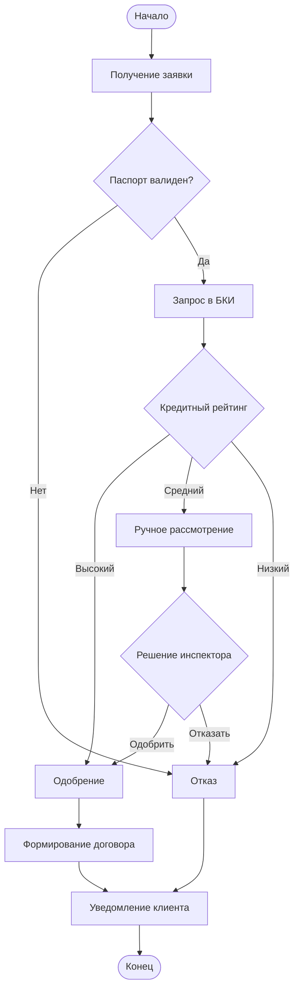
```mermaid
flowchart TD
    Start([Начало]) --> ReceiveApp[Получение заявки]
    ReceiveApp --> CheckPassport{Паспорт валиден?}
    CheckPassport -- Нет --> Reject[Отказ]
    CheckPassport -- Да --> CreditBureau[Запрос в БКИ]
    CreditBureau --> AnalyzeScore{Кредитный рейтинг}
    AnalyzeScore -- Высокий --> Approve[Одобрение]
    AnalyzeScore -- Средний --> Manual[Ручное рассмотрение]
    AnalyzeScore -- Низкий --> Reject
    Manual --> Decision{Решение инспектора}
    Decision -- Одобрить --> Approve
    Decision -- Отказать --> Reject
    Approve --> CreateContract[Формирование договора]
    CreateContract --> Notify[Уведомление клиента]
    Reject --> Notify
    Notify --> Stop([Конец])
```

---

### Практическое задание 2 (Код на C#) — Адаптер (Adapter)

```csharp
using System;

// Целевой интерфейс
public interface ILogger
{
    void Log(string message, LogLevel level);
}

public enum LogLevel
{
    Info,
    Warning,
    Error
}

// Сторонний класс (несовместимый интерфейс)
public class ThirdPartyLogger
{
    public void WriteLog(string formattedMessage)
    {
        Console.WriteLine($"[ThirdParty] {formattedMessage}");
    }
}

// Адаптер
public class LoggerAdapter : ILogger
{
    private ThirdPartyLogger _adaptee = new ThirdPartyLogger();

    public void Log(string message, LogLevel level)
    {
        string formatted = $"{DateTime.Now}: [{level}] {message}";
        _adaptee.WriteLog(formatted);
    }
}

class Program
{
    static void Main()
    {
        ILogger logger = new LoggerAdapter();
        logger.Log("Приложение запущено", LogLevel.Info);
        logger.Log("Низкий заряд батареи", LogLevel.Warning);
        logger.Log("Ошибка подключения", LogLevel.Error);

        Console.ReadKey();
    }
}
```

---
---

## Билет №19

### Ответы на тест

1. **коммуникации** (Communication Diagram) или **кооперации**
2. **прямоугольник с пунктирным прямоугольником в правом верхнем углу**
3. **стереотип** (Stereotype) или **тегированное значение**
4. **Единица работы** (Unit of Work)
5. **Абстрактная фабрика** (Abstract Factory)

---

### Практическое задание 1 (UML) — Диаграмма классов Repository + Unit of Work

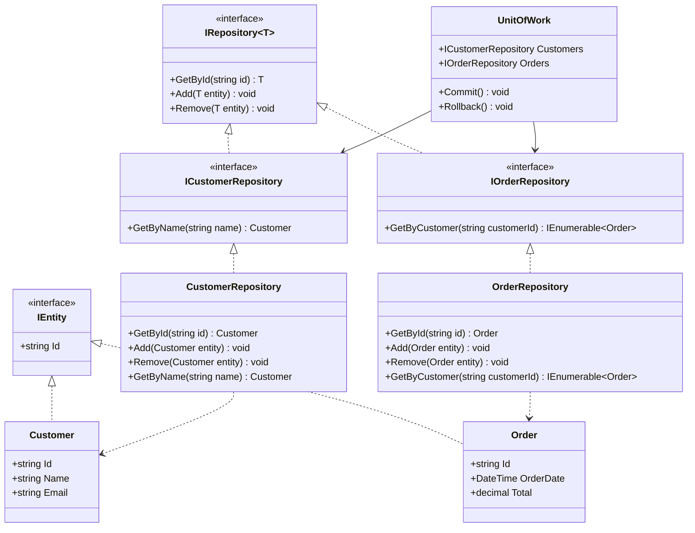
```mermaid
classDiagram
    class IEntity {
        <<interface>>
        +string Id
    }

    class Customer {
        +string Id
        +string Name
        +string Email
    }

    class Order {
        +string Id
        +DateTime OrderDate
        +decimal Total
    }

    class IRepository~T~ {
        <<interface>>
        +GetById(string id) T
        +Add(T entity) void
        +Remove(T entity) void
    }

    class ICustomerRepository {
        <<interface>>
        +GetByName(string name) Customer
    }

    class IOrderRepository {
        <<interface>>
        +GetByCustomer(string customerId) IEnumerable~Order~
    }

    class CustomerRepository {
        +GetById(string id) Customer
        +Add(Customer entity) void
        +Remove(Customer entity) void
        +GetByName(string name) Customer
    }

    class OrderRepository {
        +GetById(string id) Order
        +Add(Order entity) void
        +Remove(Order entity) void
        +GetByCustomer(string customerId) IEnumerable~Order~
    }

    class UnitOfWork {
        +ICustomerRepository Customers
        +IOrderRepository Orders
        +Commit() void
        +Rollback() void
    }

    IEntity <|.. Customer
    IEntity <|.. Order
    IRepository~T~ <|.. ICustomerRepository
    IRepository~T~ <|.. IOrderRepository
    ICustomerRepository <|.. CustomerRepository
    IOrderRepository <|.. OrderRepository
    UnitOfWork --> ICustomerRepository
    UnitOfWork --> IOrderRepository
    CustomerRepository ..> Customer
    OrderRepository ..> Order
```

---

### Практическое задание 2 (Код на C#) — Unit of Work + Repository

```csharp
using System;
using System.Collections.Generic;
using System.Linq;

// Сущности
public interface IEntity
{
    string Id { get; set; }
}

public class Product : IEntity
{
    public string Id { get; set; }
    public string Name { get; set; }
    public decimal Price { get; set; }
}

public class Category : IEntity
{
    public string Id { get; set; }
    public string Title { get; set; }
}

// Репозитории
public interface IRepository<T> where T : IEntity
{
    T GetById(string id);
    void Add(T entity);
    void Remove(T entity);
    IEnumerable<T> GetAll();
}

public class Repository<T> : IRepository<T> where T : class, IEntity
{
    protected List<T> _items = new List<T>();

    public T GetById(string id) => _items.FirstOrDefault(x => x.Id == id);
    public void Add(T entity) => _items.Add(entity);
    public void Remove(T entity) => _items.Remove(entity);
    public IEnumerable<T> GetAll() => _items;
}

public class ProductRepository : Repository<Product> { }
public class CategoryRepository : Repository<Category> { }

// Unit of Work
public class UnitOfWork
{
    private bool _committed = false;
    public ProductRepository Products { get; } = new ProductRepository();
    public CategoryRepository Categories { get; } = new CategoryRepository();

    public void Commit()
    {
        // Здесь в реальном приложении было бы сохранение в БД и транзакция
        Console.WriteLine("Изменения сохранены.");
        _committed = true;
    }

    public void Rollback()
    {
        Console.WriteLine("Откат изменений.");
        // Очистка или восстановление состояния
    }
}

class Program
{
    static void Main()
    {
        using (var uow = new UnitOfWork())
        {
            var cat = new Category { Id = "1", Title = "Электроника" };
            uow.Categories.Add(cat);

            var prod = new Product { Id = "p1", Name = "Ноутбук", Price = 50000 };
            uow.Products.Add(prod);

            uow.Commit();
        }

        Console.ReadKey();
    }
}
```

---
---

## Билет №20

### Ответы на тест

1. **14** (четырнадцать)
2. **порождающие, структурные, поведенческие**
3. **зависимость** (Dependency)
4. **Команда** (Command)
5. **CQRS** (Command Query Responsibility Segregation)

---

### Практическое задание 1 (UML) — Комплексная диаграмма классов LMS

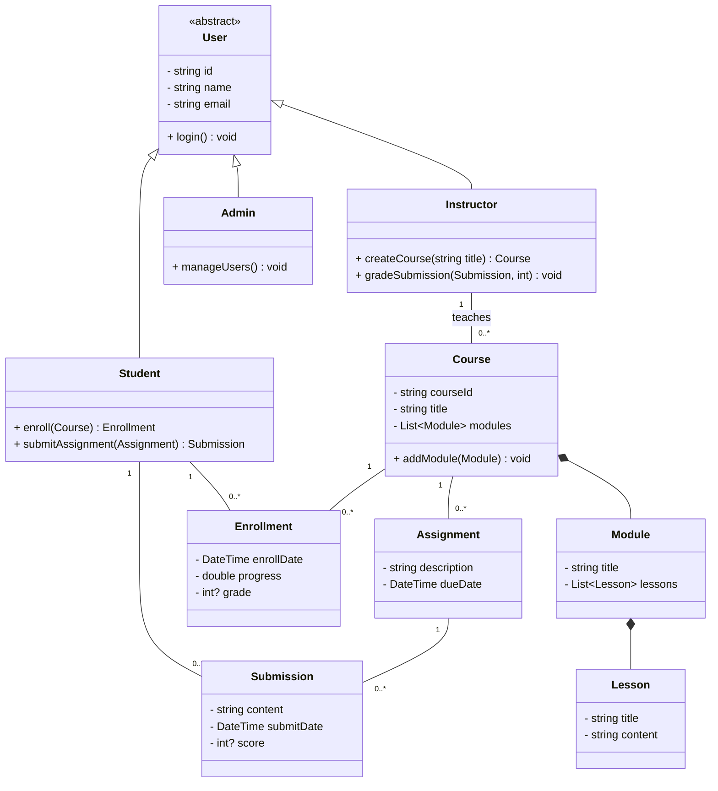
```mermaid
classDiagram
    class User {
        <<abstract>>
        - string id
        - string name
        - string email
        + login() void
    }

    class Student {
        + enroll(Course) Enrollment
        + submitAssignment(Assignment) Submission
    }

    class Instructor {
        + createCourse(string title) Course
        + gradeSubmission(Submission, int) void
    }

    class Admin {
        + manageUsers() void
    }

    class Course {
        - string courseId
        - string title
        - List~Module~ modules
        + addModule(Module) void
    }

    class Module {
        - string title
        - List~Lesson~ lessons
    }

    class Lesson {
        - string title
        - string content
    }

    class Enrollment {
        - DateTime enrollDate
        - double progress
        - int? grade
    }

    class Assignment {
        - string description
        - DateTime dueDate
    }

    class Submission {
        - string content
        - DateTime submitDate
        - int? score
    }

    User <|-- Student
    User <|-- Instructor
    User <|-- Admin
    Student "1" -- "0..*" Enrollment
    Course "1" -- "0..*" Enrollment
    Course *-- Module
    Module *-- Lesson
    Instructor "1" -- "0..*" Course : teaches
    Course "1" -- "0..*" Assignment
    Student "1" -- "0..*" Submission
    Assignment "1" -- "0..*" Submission
```

---

### Практическое задание 2 (Код на C#) — Наблюдатель + Стратегия

```csharp
using System;
using System.Collections.Generic;

// Стратегия уведомления
public interface INotificationStrategy
{
    void Notify(string message);
}

public class ConsoleNotification : INotificationStrategy
{
    public void Notify(string message) => Console.WriteLine($"[Console] {message}");
}

public class EmailNotification : INotificationStrategy
{
    private string _email;
    public EmailNotification(string email) => _email = email;
    public void Notify(string message) => Console.WriteLine($"[Email to {_email}] {message}");
}

// Наблюдатель
public interface IObserver
{
    void Update(string stockSymbol, decimal price);
}

public class Investor : IObserver
{
    private string _name;
    private INotificationStrategy _strategy;

    public Investor(string name, INotificationStrategy strategy)
    {
        _name = name;
        _strategy = strategy;
    }

    public void Update(string stockSymbol, decimal price)
    {
        string message = $"{_name} уведомлён: {stockSymbol} теперь {price}";
        _strategy.Notify(message);
    }
}

// Наблюдаемый объект
public class Stock
{
    private string _symbol;
    private decimal _price;
    private List<IObserver> _observers = new List<IObserver>();

    public Stock(string symbol, decimal initialPrice)
    {
        _symbol = symbol;
        _price = initialPrice;
    }

    public void Attach(IObserver observer) => _observers.Add(observer);
    public void Detach(IObserver observer) => _observers.Remove(observer);

    public decimal Price
    {
        get => _price;
        set
        {
            if (_price != value)
            {
                _price = value;
                Notify();
            }
        }
    }

    private void Notify()
    {
        foreach (var obs in _observers)
            obs.Update(_symbol, _price);
    }
}

class Program
{
    static void Main()
    {
        Stock apple = new Stock("AAPL", 150m);

        Investor investor1 = new Investor("Иван", new ConsoleNotification());
        Investor investor2 = new Investor("Мария", new EmailNotification("maria@example.com"));

        apple.Attach(investor1);
        apple.Attach(investor2);

        apple.Price = 155m;
        apple.Price = 160m;

        apple.Detach(investor1);
        apple.Price = 162m;

        Console.ReadKey();
    }
}
```

---
